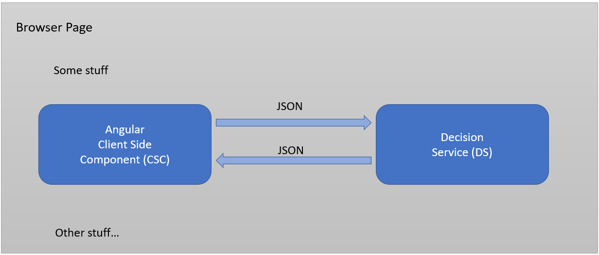
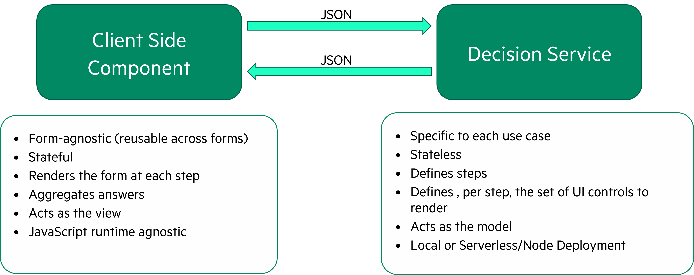

# Dynamic Forms with Corticon.js

- [Dynamic Forms with Corticon.js](#dynamic-forms-with-corticonjs)
  - [What it is](#what-it-is)
  - [Design Pattern](#design-pattern)
  - [Dynamic Forms with Corticon.js](#dynamic-forms-with-corticonjs-1)
    - [Interaction between Decision Services and the CSC](#interaction-between-decision-services-and-the-csc)
- [Getting Started](#getting-started)
  - [Corticon.js Installation](#corticonjs-installation)
    - [Brand New Users](#brand-new-users)
    - [Users with an Active Corticon.js License](#users-with-an-active-corticonjs-license)
  - [Setting up your environment](#setting-up-your-environment)
  - [Accessing the samples repository](#accessing-the-samples-repository)

## What it is

Dynamic Forms are just one use case for Corticon.js.  In a nutshell, with Corticon and Corticon.js, you use a model-driven development environment called Corticon Studio for defining rules that will change input data based upon conditions and their resulting actions. Typically, a rules engine is used for making a decision from data that is _already known and available_, for example, calculating a loan rate based upon the data known about an applicant. Here, we're going to be _gathering data_ from the end user, dynamically presenting additional user prompts that may be impacted based upon previous answers.

## Design Pattern

Think of this design pattern as if you're designing a robot. Rule modelers will use Corticon to build the brain of the robot, while front end developers will handle its body. 

Corticon will be used to specify what prompts to present to the user, the input type for responding to the prompt, in what order to present the prompts, constraints/validations on the entered data, how the previous responses may or may not impact subsequent prompts, and when the requisite data has been gathered and is ready to be passed along to downstream systems. This is all defined in Corticon.js Studio, but are then transformed into a Decision Service-- the robot brain. 

The front end/client-side component in turn will be responsible for the styles of the forms' user interface and prompts, communicating with the decision service when the user hits 'next', rendering the components of the form that the decision service specifies, along with any constraints and validations it specifies.

For example, consider a car insurance application. Insurers in the United States are regulated at the state level, and states allow different kinds of factors to be weighed as part of the evaluation. A dynamic form for the insurance application can thus be used to only present prompts based upon the insured's state of residence. Depending upon the number of drivers, the number of vehicles, and the types of vehicles, different prompts would need to be presented, and different data elements captured. 

This logic can be managed in business rules by leveraging the fact that the deployable in Corticon.js is a self contained JavaScript bundle, so all rule logic can be built directly into a front end website or app to guide the rendering of the form. 

Rules define the model for what, when, and how to present prompts to an end user independently of the definition of how these prompts are presented stylistically in the front end UI (denoted here as the Client Side Component, or CSC).

## Dynamic Forms with Corticon.js

Think of this design pattern as if you're designing a robot. Rule modelers will use Corticon to build the brain of the robot, while front end developers will handle its body. 

Corticon will be used to specify what prompts to present to the user, the input type for responding to the prompt, in what order to present the prompts, constraints/validations on the entered data, how the previous responses may or may not impact subsequent prompts, and when the requisite data has been gathered and is ready to be passed along to downstream systems. This is all defined in Corticon.js Studio, but are then transformed into a Decision Service-- the robot brain. 

The front end/client-side component in turn will be responsible for the styles of the forms' user interface and prompts, communicating with the decision service when the user hits 'next', rendering the components of the form that the decision service specifies, along with any constraints and validations it specifies.

For example, consider a car insurance application. Insurers in the United States are regulated at the state level, and states allow different kinds of factors to be weighed as part of the evaluation. A dynamic form for the insurance application can thus be used to only present prompts based upon the insured's state of residence. Depending upon the number of drivers, the number of vehicles, and the types of vehicles, different prompts would need to be presented, and different data elements captured. 

This logic can be managed in business rules by leveraging the fact that the deployable in Corticon.js is a self contained JavaScript bundle, so all rule logic can be built directly into a front end website or app to guide the rendering of the form. 

### Interaction between Decision Services and the CSC

The CSC does not _know_ the questions to be asked at each step and what the answers mean, but it knows _how to render_ these questions and collect the answers. The decision services do not know the current state of the questionnaire, but know what to do at each step.

Here is a visual representation of the interaction between the CSC and Decision Service:

The decision service that is built into the dynamic form webpage specifies the forms' prompts, the constraints on responses, where to store the answers and what paths to take based on various conditions. 

Here is a summary of the roles and responsibilities:

# Getting Started

## Corticon.js Installation

### Brand New Users

1. Sign up using the 'Try Now' link at [this page](https://www.progress.com/corticon-js)
2. Download and install using default installation settings

### Users with an Active Corticon.js License

*   Access Corticon.js Studio installer by clicking Corticon at [this page](https://www.progress.com/support/download-center)

Questions? Consult the [installation documentation](https://docs.progress.com/bundle/corticon-js-introduction/page/Install-Corticon.js-Studio.html) from the official Corticon documentation site.

## Setting up your environment

When we build the dynamic form rules, we're ultimately going to be transpiling the rules into a self-contained JavaScript bundle. In simpler terms, all of the logic will be encapsulated into just one file decisionServiceBundle.js. 

Front end developers handle the 'rendering side' of the form. This includes defining data that will be passed in at the onset of the form, styling, and where the data goes once the form is filled out. 

To make everyone's life easier, we provide  open source implementations of Corticon.js Dynamic Forms which you can freely download, import into your environment, and adapt to your needs. This includes both sample rule assets that you can work with in Corticon.js Studio, and a sample client side rendering component. 

## Accessing the samples repository

There are many tools out there for working with git repositories; here we'll outline one approach from the standpoint of someone with little to no development experience.

Access the Sample Rule Assets in Corticon.js Studio:

1. Create a user account on [Github.com](github.com)
2. [Download Github Desktop](https://desktop.github.com/) and [install](https://docs.github.com/en/desktop) with default settings. Authorize the application with your Github login. 
3. From [this link](https://github.com/corticon/corticon.js-samples), click the green "Code" button, then 'Open with GitHub Desktop'
4. If desired, change the default 'Local path'
5. Click 'Clone'
6. Open Corticon.js Studio
7. Click File > Import > Expand out 'Git' > Projects from Git then click next
8. Select 'Existing local repository' then click next
9. Navigate to where the repository was cloned then click next
10. Click 'Import as general project'
11. Click on the folder 'Dynamic Forms' under 'Working Tree' then click next
12. Hit finish
  
The documentation now forks into two learning paths- one for the rule modeler defining form rule behavior, the other for front end developers that implement the client side component. 

- [**Authoring business rules to define form behavior**](docs/AuthoringDecisionService.md)
- [**Deep dive into the Client Side Component renderer**](docs/AuthoringClientSideComponents.md)
