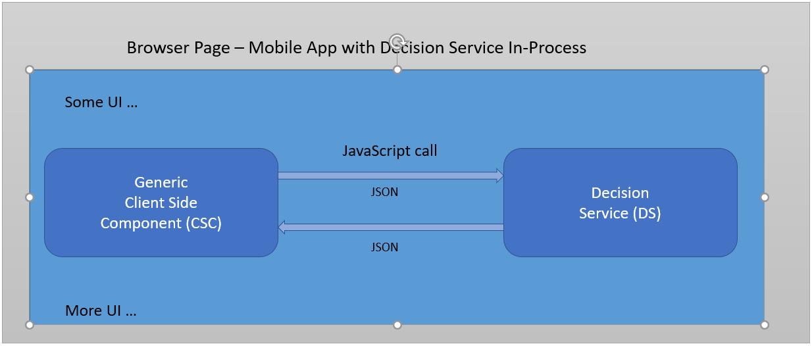
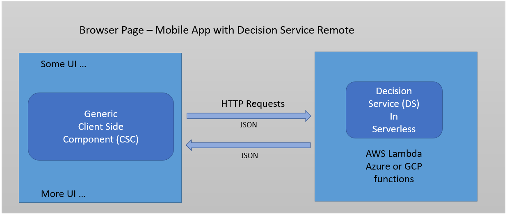
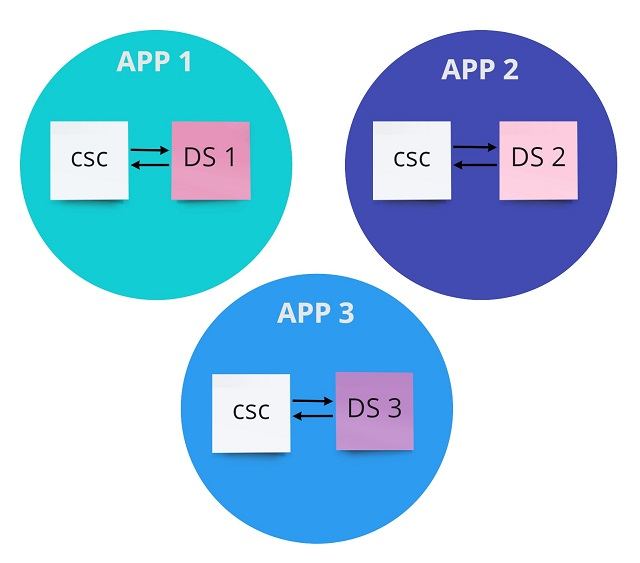
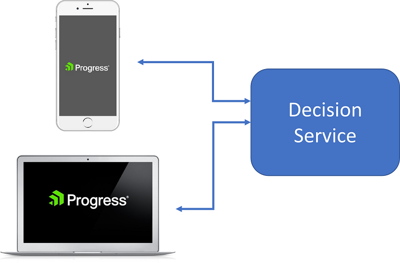

# Business Rule Driven Dynamic Forms

## Summary

- A single component for rendering dynamic questionnaires can be reused with multiple applications
- In other words, to implement a new use cases, you only need to develop the *model* for the new use case.
- Additionally, the same model can be used to drive dynamic questionnaires on different platforms (for example, Web page and Mobile device).
- All of this provides agility and improves delivery time.

## Introduction

Implementing the intricacies of a dynamic form's user interface often entails a degree of implementation complexity comparable to that of a traditional decision automation use case (e.g. eligibility determination, claims handling, loan origination...). 

With Corticon.js, we can define this logic using the same declarative, rules-driven paradigm that enables traditional decision automation.

There are a wide array of UI paradigms fit for the purpose of building forms with a multitude of questions/prompts, the answers from which will be passed into downstream workflows. 
But the form logic can evolve into a monolith in its own right when:

1.  Answers to the form's earlier questions change which questions are asked later in the form.
2.  The questions change frequently.
3.  External data must be wrangled from external systems in order to pre-populate or predetermine certain steps.

Quickly, the number of unique paths which a user can progress through increases exponentially, as does the effort required to maintain and update them.

Using a rules-driven paradigm for dynamic form logic, authored with a proven decision automation engine like [Corticon.js](https://www.progress.com/corticon-js), this complexity can be tamed through logic modularization and data abstraction.

Rules define the model for what, when, and how to present prompts to an end user independently of the definition of how these prompts are presented stylistically in the front end UI (denoted here as the Client Side Component, or CSC).

## I thought Corticon was just a business rules engine?

Dynamic Forms are just one use case for Corticon.js.  In a nutshell, with Corticon and Corticon.js, you use a model-driven development environment called Corticon Studio for defining rules that will change input data based upon conditions and their resulting actions. 

Typically, a rules engine is used for making a decision from data that is _already known and available_, for example, calculating a loan rate based upon the data known about an applicant. Here, we're going to be _gathering data_ from the end user, dynamically presenting additional user prompts that may be impacted based upon previous answers.

## Dynamic Forms with Corticon.js

Think of this design pattern as if you're designing a robot. Rule modelers will use Corticon to build the brain of the robot, while front end developers will handle its body. 

Corticon will be used to specify what prompts to present to the user, the input type for responding to the prompt, in what order to present the prompts, constraints/validations on the entered data, how the previous responses may or may not impact subsequent prompts, and when the requisite data has been gathered and is ready to be passed along to downstream systems. This is all defined in Corticon.js Studio, but are then transformed into a Decision Service-- the robot brain. 

The front end/client-side component in turn will be responsible for the styles of the forms' user interface and prompts, communicating with the decision service when the user hits 'next', rendering the components of the form that the decision service specifies, along with any constraints and validations it specifies.

For example, consider a car insurance application. Insurers in the United States are regulated at the state level, and states allow different kinds of factors to be weighed as part of the evaluation. A dynamic form for the insurance application can thus be used to only present prompts based upon the insured's state of residence. Depending upon the number of drivers, the number of vehicles, and the types of vehicles, different prompts would need to be presented, and different data elements captured. 

This logic can be managed in business rules by leveraging the fact that the deployable in Corticon.js is a self contained JavaScript bundle, so all rule logic can be built directly into a front end website or app to guide the rendering of the form. 

## Try it out

It may be easiest to conceptualize Corticon.js Dynamic Forms by first checking out the samples that you can interact with as an end user, leveraging the 'test driver' web page. 

You can launch it right away at [this link](https://refined-github-html-preview.kidonng.workers.dev/corticon/corticon.js-samples/raw/master/DynamicForms/CSC/client.html), or review the HTML [here](https://github.com/corticon/corticon.js-samples/blob/master/DynamicForms/CSC/client.html).

### The Client Side Component (CSC)

The Dynamic Forms in the sample page are rendered by a reusable, adaptable template referred to as the Client Side Component (CSC). By template, we mean that the same CSC can be reused for multiple questionnaires without any front end client changes. When you switch samples with the dropdown sample selector, you're in a different dynamic form; however it is using the CSC for all the samples.

This framework of separating the CSC from the rules promotes agility for development teams, as it disentangles the 'instructions' logic for what to present to the user (defined in a Corticon.js decision service) and the code that renders the form based upon these instructions.
Typically, a CSC is written and maintained by a developer or a team of developers while the decision services are written by business analysts who understand well the problem domain of the questionnaire.

If you are familiar with model/views design patterns; you can consider the CSC to be the view while the model is created and maintained using a [Corticon.js](https://www.progress.com/corticon-js) decision service.

The decision service defines a model for the questionnaire independently of how it is rendered in the front end UI and device.

### Interaction between Decision Services and the CSC

The CSC does not _know_ the questions to be asked at each step and what the answers mean, but it knows _how to render_ these questions and collect the answers. The decision services do not know the current state of the questionnaire, but know what to do at each step.

Here is a visual representation of the interaction between the CSC and Decision Service:

The decision service that is built into the dynamic form webpage specifies the forms' prompts, the constraints on responses, where to store the answers and what paths to take based on various conditions. 

Here is a summary of the roles and responsibilities:

## Local versus Remote Decision Services

Decision services can be run in process within the CSC or maintained in and invoked at a remote environment.

For the remote option, Corticon.js supports deployments to:

-  Any of the major cloud vendors' serverless environments (AWS Lambda, Azure and GCP functions)
-  Node.js servers
-  Traditional Java server running either in the cloud or on premises (traditional server deployments)

In-process deployments provide essentially instant response time, however, there are considerations for when it might make more sense to run maintain this logic in remote environments, such as:

- For Mobile Apps: a decision service hosted remotely can be updated very easily without having to force the user to reinstall the app.
- To address security:
	- Don’t want to expose some of the data used in the decision process.
	- Want to have the decision service access various data sources inside the firewall.
	- Don't want to risk exposing the decision service to reverse engineering.

There are only minor distinctions between how the CSC and decision service interactions take place 
when running in-process or remotely as illustrated in the 2 diagrams below:

 
 

## Building and integrating a rule-driven form's components

For more detail on the CSC and the decision service please refer to these documents:

1. [Authoring a the dynamic form logic in Corticon (these will be generated into the Decision Service) ](docs/AuthoringDecisionService.md)
2. [Building and configuring the client side component (CSC)](docs/AuthoringClientSideComponents.md)

# Benefits

A single component for rendering dynamic questionnaires can be reused with multiple
applications as illustrated below:

In other words, to implement a new use cases, you only need to develop the model for the new use case.

Additionally, the same model can be used to drive dynamic questionnaires on different platforms
(for example, Web page and Mobile device).

All of this provides agility and improves delivery time.

## Getting Started

To make it easy to familiarize yourself with the concepts, we have made available several samples
that you can run from a test driver web page.

To get started:
* clone the repository https://github.com/corticon/corticon.js-samples/ or download it as a zip file
* invoke client.html (available at https://github.com/corticon/corticon.js-samples/blob/master/DynamicForms/CSC/client.html)
* go through each sample to get a feel for what is available
* Run the canonical sample. Each step in this sample shows how to use a specific UI control and display
  the corresponding Corticon rulesheet file in the title of the container.  You can then use the corresponding rulesheet as an example to implement what you need.

## Additional Resources

Find out more about [Corticon.js](https://www.progress.com/corticon-js)

You can check [these blogs](https://www.progress.com/blogs/author/thierry-ciot) for Corticon news and features as well as Serverless industry trends.

Free training for Corticon.js at [https://www.progress.com/blogs/learning-opportunity-available-get-started-corticonjs-rules-today](https://www.progress.com/blogs/learning-opportunity-available-get-started-corticonjs-rules-today)
