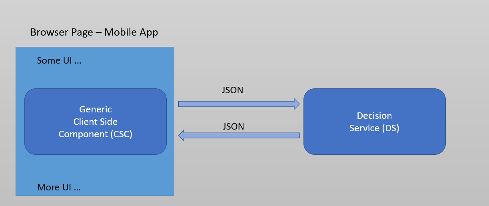
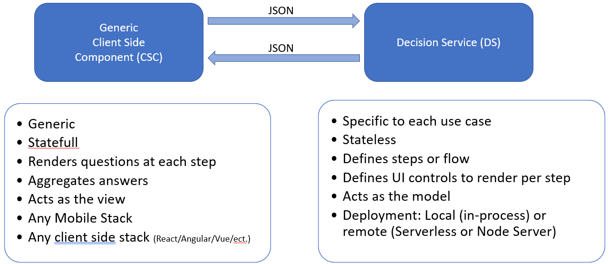

# Rules Based Dynamic Forms

## Introduction

It is common to have user interactions requiring asking multiple questions. 
Several UI paradigms have been developed and most UI developers have solutions today.  However, the difficulty comes when:
1)	The set of questions is large or becomes larger as is typical of many business processes nowadays.
2)	The questions need to be changed frequently.
3)	And, more interestingly, the set of questions to ask depends on either or both answers from previous steps 
      and external data leading to independent paths for various users.

Consequently, the total number of paths quickly increases (usually exponentially) and overwhelms the development team.   
Programing all of these in code puts an enormous burden on the front-end development and testing teams.  
It is difficult to scale up

Rules based dynamic forms are used in situations where there are:
1. multiple paths in the flow of questions to ask the user
2. there are many questions.

The solution offered here is to use a rule system to separate what questions to ask at each step of the process 
and what paths the flow of questions take from the UI code responsible from rendering the “questions/answers wizard”.  
Another way to put it, is the rule system defines a model for the questionnaire independently of how it is rendered in the
front end UI and device.

Note: These forms are sometimes called Dynamic Questionnaires.  

## Design

These Dynamic Questionnaires are rendered by a generic client side component (CSC).  By generic, we mean that the same CSC can be 
reused for multiple questionnaires without any changes.  This promotes agility for the development team.

The CSC renders the questionnaire following the instructions from a set of rules embedded in a decision service (DS).

Here is a visual representation:

The CSC does not know the questions to be asked at each step and what the answers mean but it knows
how to render these questions and collect the answers.

The decision service (DS) driving the dynamic forms, specify what the questions, the constraints on questions and where to store the
answers.  The DS do not know the current state of the questionnaire but know what to do at each step.

Typically, a CSC is written and maintained by a developer or a team of developers while the DS are written by business analysts 
who understand well the problem domain of the questionnaire.

Here is a summary of the roles and responsibilities:

For more detail on the CSC and the DS please refer to these documents:
1. [Authoring a decision service (DS)](docs/AuthoringDecisionService.md)
2. [Authoring a client side component (CSC)](docs/AuthoringClientSideComponents.md)

## Definition - Terms

* Rulesheet: the Corticon condition and actions sheet where the modeler specifies the business rules for rendering the dynamic questionnaire
* Ruleflow: the Corticon unit of decision service deployment.
* Flow: The set of stages the user goes through in a specific scenario (Synonym with path)
* Stage: a unique identifier representing where the flow currently is at in the state machine.

