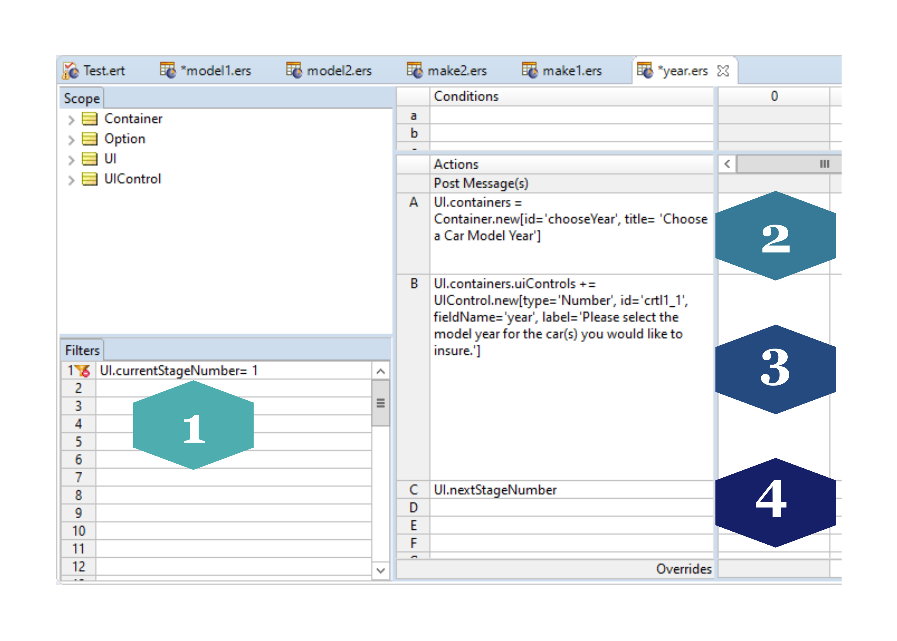
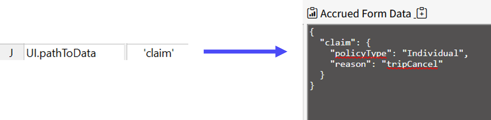
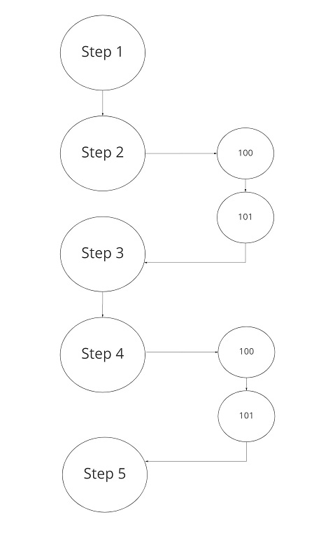
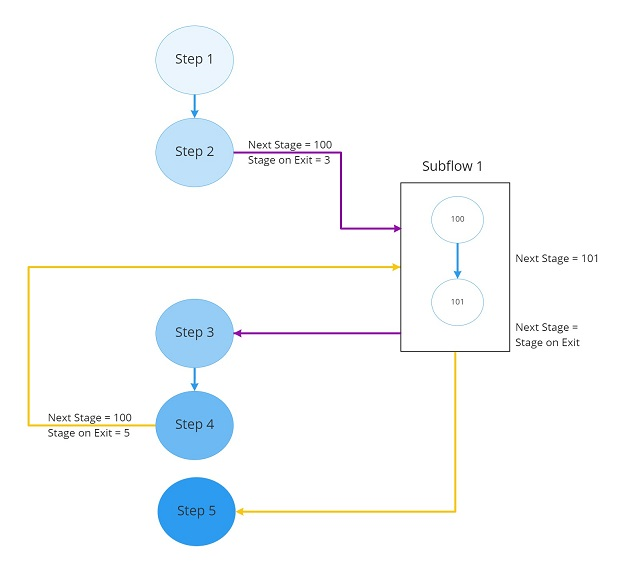
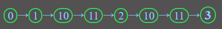

## Defining the Rules 

### Ruleflows

The Decision Service is generated from a Corticon Ruleflow. A Ruleflow is how Corticon assembles and organizes the components of a set of rules into a single unit. It is a presented as a flow diagram, where Rulesheets and  other Ruleflows are encapsulated into a 'top-level' ruleflow. 

In contrast to a typical decision automation use case, when creating dynamic forms with Corticon.js, rulesheets and ruleflows are not 'connected' from one to another when constructing the top level ruleflow. Connections are the objects that connect or “stitch” assets and objects together to control their sequence of execution. 

If a connector is drawn from Rulesheet `sample1.ers` to `sample2.ers`, then when a deployed Ruleflow is invoked, it will execute the rules in `sample1.ers` first, followed by the rules in `sample2.ers`.

For dynamic forms however, instead of a decision that will always go through the same chronology during a single execution, dynamic forms require the ability to navigate throughout the objects in a ruleflow, such that different rules may fire depending upon dynamic variables. For example, the sequence may be determined based upon:

-   Data that the end user has entered to that point (e.g. route to different parts of a ruleflow depending upon what type of claim a user has chosen to file)
-    whether any data is pre-populated at the start of a ruleflow (e.g. user had to log in prior to beginning form, so information tied to their account is leveraged in determining the route through which to fill the form)

<table><tr>
<td> 
  <p align="center" style="padding: 10px">
    
    <br>
    <em style="color: grey">Dynamic Form Ruleflow </em>
  </p> 
</td>
<td> 
  <p align="center">
    
    <br>
    <em style="color: grey">Typical, Connected Ruleflow</em>
  </p> 
</td>
</tr></table>


The main function of the rules, from which the Decision Service is generated, are to define:

1.  The flow of the questions (What prompt is presented when and base upon what).
2.  For each step, either:
   
	- What user prompt to render (e.g. dropdown, true/false, number, etc). Henceforth, we refer to these user prompts as **UI Controls**. 
	- Execute some business logic or computation that doesn't involve presenting anything to the user (e.g. add together dollar amount of all expenses being submitted)
3. Which data should be retained and accrued to pass along upon form completion, versus which data is only relevant ephemerally (e.g., assigning data related to a claim to be retained, while assigning the response to '_Do you have more claims to submit_?' to be discarded. 

### How we define _what_ happens _when_

The CSC does not know the questions to be asked at each step or what the answers mean, but it knows how to render these questions and collect the answers. 

The rules group together all of the logic applicable to a question and its answer within a shared **Stage.** The decision service does not know the current state of the questionnaire but knows what to do at each stage.

A Stage is typically implemented using one or more **[Rulesheets](https://github.com/corticon/corticon.js-samples/tree/master/DynamicForms#authoring-the-rules)**. When building dynamic forms, the rulesheets typically specify:
1. Current stage number
2. If presenting anything to the end user at this step, a  **Container** to host the UI controls is created.
3. Within a container, 1 or more UI controls are created (e.g. text input, numeric input, checkbox, or multiple choice dropdown list.)
4. What the next stage is 



Once all rulesheets in the ruleflow have been arranged and [tested](https://github.com/corticon/corticon.js-samples/tree/master/DynamicForms#testing-the-rules), the ruleflow is deployed as a JavaScript Decision Service bundle--a single file called `decisionServiceBundle.js`.

## What the CSC needs from the rules

The decision service informs the front end UI each and every prompt to present to the user, throughout the form. It likewise may define whether to execute a decision/computation in the background before moving on to subsequent stages. 

The content presented in the form at a given point can define different paths depending upon
 * Previously entered data data entry to make decisions. For example, the form may branch to a different step, or specify different UI controls 
 * The output of decisions and computations performed between steps
 * Data already known about the end user, for example data populated from an external CRM system


There are certain rules which are useful to implement only at the start or end of the form. For example, telling the CSC where to store the accrued form data, and telling the CSC when the form is complete.

#### Setting the Path to Data
By default, data is stored in the entity with the name assigned to the `UI.pathToData` attribute. 

Below, on an initial auto insurance form, we're assigning the 'vehicle' entity to be the vocabulary entity / JSON object within which the accrued data will be stored:



If we're just collecting the end user's responses for year/make/model of a vehicle, upon the form's completion, the accrued data would look something like:

```
    {
      "vehicle": {
        "year": 2020,
        "make": "Mazda",
        "model": "Cx-3 4Dr Awd"
      }
    }
```


#### Setting the Final Rulesheet

It needs to specify that the questionnaire is done using an action like this: `UI.done = T`

>Note: other rulesheets do not need to specify `UI.done = F`

# Typical Patterns

## Executing Step with No UI to Render

Sometimes the Decision Service needs to execute a stage with no associated UI to render; for example, the Decision Service just needs to execute business logic and move to next step.

This is specified by the Decision Service in the attribute UI.noUiToRenderContinue (a boolean)

Note: The CSC needs to keep calling the Decision Service by setting the UI.currentStageNumber to UI.nextStageNumber until the flag noUiToRenderContinue is not set (undefined) or set to false.

## Validation

There are 2 kinds of validation:

1. The first one is at the UI control itself and can directly be enforced by the CSC. For this validation, the CSC does not need to call the Decision Service for validation. It can enforce the validation directly based on various attributes sets on the UIControl and the type of UIControl. For examples, we may set an input field as required or we may want a number field where the valid data is between 1 and 20. These are specified in the Decision Service model using the UIControl.required and UIControl.min and UIControl.max attributes respectively.

2) The second kind is validation that can only be enforced by the Decision Service (remember the CSC is generic and the Decision Service is use case specific). The DS can implement simple to very complex business rules to infer that some answers may not be valid using all the data available to it (That is data from previously entered user inputs, external data and initial data). And that validation may be conditional to various paths or various conditions. For example, validating that a claim cannot exceed some amount because the sum of all current claim exceeds the maximum for the month.

### Decision Service Validation Pattern

The design pattern is to have a first rulesheet for specifying the UI and another one for data validation. Both executes on the same stage number and, as a consequence, the step always executes the 2 rulesheets. And it executes them at least 2 times. 

The first time, the UI rulesheet specifies the controls to render with no default values and the validation rulesheet does not really have any effect as the data to be entered is null. However, in the second execution, the user data is validated and a decision is made to continue to the next step if validation passes or to go back to the UI if validation fails.

The only difference between the 2 passes is that in the first pass there is no data yet while in the second pass, there is data to validate. And if validation fails, we want to reuse the data as the default value for the UI Controls so that the user does not have to retype everything and can just correct the data.

To understand the details, let’s look at our validation sample available at https://github.com/corticon/corticon.js-samples/tree/master/DynamicForms/DS/ValidationSample:

The first rulesheet (Step1.ers) creates the UI as usual and does not set a next stage. That way, we will re-enter the step after the user has submitted data. 

The second rulesheet (Step1Validation.ers) does the data validation.

When the CSC submits the current step, the Decision Service executes both rulesheets again but this time with the data entered by the user. If the validation passes, then we move to next stage (the validation rulesheet sets stage to next stage).

If the validation fails, then we go back to rendering the UI for the same step but this time we have both the data entered by the user and a set of validation messages to render as well. The data entered by the user is set as the default value of the UI control (using the value attribute).

Let's look in details at some key attributes at play, in the validation rulesheet (Step1Validation.ers):

1. when the validation passes the rulesheet sets UI.nextStageNumber to the next stage and the flag “UI.noUiToRenderContinue” to True. That way the client side component knows to execute the decision service a second time to get to the next stage. 2. when the validation fails the rulesheet sets UI.nextStageNumber to the same stage; so we keep executing till the validation succeeds. 

## Reusing Some Stages (Reuse via Subflows)

Sometimes multiple paths share a common set of steps (Stages) as shown in this image:



One way to achieve reuse is to create a separate ruleflow and use it inside another ruleflow (this is the concept of a subflow). 

The subflow does not contain anything special. It just contains the set of stages the subflow needs to achieve its purpose. Once completed, the subflow can be dragged into the main ruleflow similarly to how we drag rulesheets into a ruleflow.

As a subflow can be invoked from different stages, the UI.nextStageNumber is not known in advance. To solve that problem we follow the following pattern:

* Before invoking a subflow, the main flow (the flow calling the reusable flow) needs to set UI.stageOnExit to where the subflow needs to resume. * The subflow needs to set UI.nextStageNumber to UI.stageOnExit

This is illustrated in the following diagram:



### Sample

To become familiar with this pattern, check the sample: ReusingFlowSample at https://github.com/corticon/corticon.js-samples/tree/master/DynamicForms/DS/ReusingFlowSample

In this sample, the subflow is implemented in stage 10 and 11. We reuse it twice, the first time from stage 1 and the second time from stage 2 as shown below:



Notice, the first time the subflow will return to stage 2 and the second time to stage 3. 

 # Getting Started

The best way to get started is to first try the various samples provided out of the box. 

To get started: * invoke client.html (available at https://github.com/corticon/corticon.js-samples/blob/master/DynamicForms/CSC/client.html) * go through each sample to get a feel for what is available * Run the canonical sample. Each step in this sample shows how to use a specific UI control and display the corresponding Corticon rulesheet file in the title of the container. You can then use the corresponding step rulesheet as an example to implement what you need in your own project.

# Additional Resources

Find out more about [Corticon.js](https://www.progress.com/corticon-js)

You can check [these blogs](https://www.progress.com/blogs/author/thierry-ciot) for Corticon news and features as well as Serverless industry trends.

Free training for Corticon.js at https://www.progress.com/blogs/learning-opportunity-available-get-started-corticonjs-rules-today

