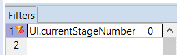
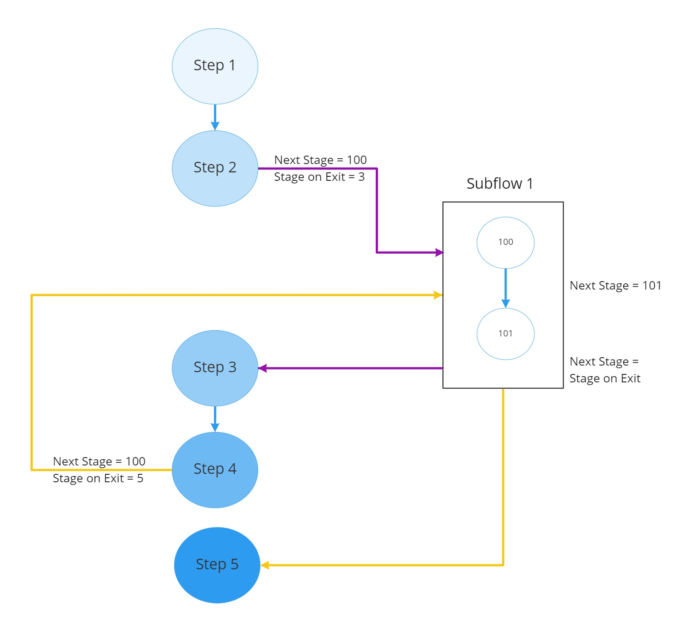

# Introduction

Decision Service (Rules Based Questions)

The DS is composed of a series of Corticon rulesheets and at least one ruleflow including the rulesheets.  
The main responsibilities of the DS is to specify:
1. The flow of the questions (step by step).
2. For each step, either:
    * What UI controls to render (questions to ask)
    * Implement some business logic or computation before executing the next step
3. Where to store the accumulated data entered by the user or data computed at various steps.

A step is typically implemented with one or more rulesheets.

A single rulesheet specifies 3 main items:
1.	It creates 1 or more container to host the UI controls (This can be viewed as the panel that will contain the questions).
2.	It adds to the container, 1 or more UI controls.  There are various types of controls available.  See the UIControlType enumeration in Corticon.js vocabulary custom data types.  For examples, one can create a text input or a numeric input or a single choice (dropdown list) or multiple choices (checkboxes) or readonly text.
3.	It sets the next step to execute in the flow using the stage attribute.  At the end of the flow, it also sets the done flag.

# How to Write Decision Services with Corticon

Corticon is a very versatile product, as such there are many ways to approach and solve problems
with it.  We have developed one approach and a set of patterns that will help you getting started
very quickly with complex rules based dynamic forms.  
Feel free to use the solution as is or to adapt it to your own need as you see fit.

## What does the decision service do?
Below is high level summary. And we will get into detailed descriptions in subsequent sections:
* The decision service (DS) provides the set of steps and paths to take for complex rules-based questionnaires.  The paths can be viewed as a tree of decisions where each branch is a set of different questions (of course there is provision for reusing set of steps that are common to various paths).
* A step is typically composed of one or more stages.  The stage is a number that identifies what needs to happen for a specific step in the questionnaire.
* At each step the DS provides the set of UI controls to render and their properties:
   * It can leverage previous data entry to make decisions.
   For example, decide to branch to a different step or to specify different UI controls to render
   * It can perform complex business logic and computations (non-UI Step).
* The DS is composed of a series of Corticon rulesheets that represent, in an abstract manner:
   * The flow of the questions (step by step).  
   * For each step, either:
      * What UI controls to render (questions to ask)
      * Implement some business logic/complex computation before executing the next step
* The DS specifies where to store both:
   * the accumulated data entered by the user (See fieldName attribute on UIControl)
   * and results of business logic

## Stages and Steps

What are stages?

The stage is a number that identifies what needs to happen for a specific step in the questionnaire.  
A typical questionnaire goes through many stages.  For example, it can go through stage 1, 2, 3, 4 and 10 
if the user answers yes to the first question and through stage 1, 5, 6, 7, 8, 9 and 10 if the user 
answers no to the first question.

As a modeler and creator of the DS you decide what stage numbers to assign to the various stages
used in the overall questionnaire.  

What are Steps?

It is what happens in a single step in the UI (the CSC).  
For example, it could be a single question to ask the user for a yes / no answer.  
If the user answers Yes, the DS may take go down one path while if the user answers no, 
the DS will go down another path.  

However, a step may be composed of more than one question.
* A step is typically implemented with one or more rulesheets.
* A single rulesheet specifies 3 main items:
   * It creates 1 or more containers to host the UI controls
   * It adds to the container, 1 or more UI controls.  There are various types of controls available.  See the UIControlType enumeration in the vocabulary custom data types.  
   * It sets the next stage to execute in the flow and at the end of the flow, it sets the done flag.

# Basic Questionnaire

In this section we will see the minimum items you need to create for a trivial questionnaire.
Let’s imagine our questionnaire is so simple that it has only 2 steps.  Step 1 and 2.  

You would create 2 rulesheets: Step1.ers and Step2.ers

The first thing you need to do when creating a rulesheet is to assign a pre-condition filter to specify what stage the rulesheet executes.  This is done using a filter like this: UI.currentStageNumber = <stageNbr>
Where stageNbr is the actual number.  For example for stage 0:

And you would create an action to specify the next stage like this:
UI.nextStageNumber = 1

This means from stage 0, the next step will go to rulesheet filtered on stage 1.

Additionally, in the first rulesheet, you will typically specify some initialization attributes like:
* The base path to where to store data.  It is specified in the attribute:  UI.pathToData
It is the base path of where all the answers will be stored.  This is very useful when you have multiple projects and you are writing multiple decision services.
If you don’t set this parameter, all answers will be stored at the root of the project json data.
* Whether the question labels are displayed next to the input field or above using the attribute: UI.labelPosition

## Typical Rulesheet

It will set the next stage to execute using:
UI.nextStageNumber = <stageNbr>
For example: UI.nextStageNumber = 23

It would typically specify UI controls to render, and it could do this conditionally to previous answers.  
For example, rendering a different control if the user entered yes on a first step.

See the canonical sample for examples of the supported UI Controls and in particular look at Step3.ers
as an example where we specify ui controls based on previous inputs.

## Last Rulesheet

It needs to specify that the questionnaire is done using an action like this: UI.done = T

Note: other rulesheets do not need to specify UI.done = F

# Typical Patterns

## Executing Step with No UI to Render

Sometimes the DS needs to execute a stage with no associated UI to render; for example, the DS just needs to execute
business logic and move to next step.

This is specified by the DS in the attribute UI.noUiToRenderContinue (a boolean)

Note: The CSC needs to keep calling the DS by setting the UI.currentStageNumber to UI.nextStageNumber until the flag
noUiToRenderContinue is not set (undefined) or set to false.

## Validation

There are 2 kinds of validation:

1. The first one is at the UI control itself and can directly be enforced by the CSC.  
   For this validation, the CSC does not need to call the DS for validation.  
   It can enforce the validation directly based on various attributes sets on the UIControl and the type of UIControl.  
   For examples, we may set an input field as required or we may want a number field where the valid data is between 1 and 20.  
   These are specified in the DS model using the UIControl.required and UIControl.min and UIControl.max attributes respectively.

2)	The second kind is validation that can only be enforced by the DS (remember the CSC is generic and the DS is use case specific). 
      The DS can implement simple to very complex business rules to infer that some answers may not be valid
      using all the data available to it (That is data from previously entered user inputs, external data and initial data).  
      And that validation may be conditional to various paths or various conditions.
      
      For example, validating that a claim cannot exceed some amount because the sum of all current claim exceeds the maximum for 
      the month.

### DS Validation Pattern

The design pattern is to have a first rulesheet for specifying the UI and another one for data validation.  
Both executes on the same stage number and, as a consequence, the step always executes the 2 rulesheets.  
And it executes them at least 2 times.  

The first time, the UI rulesheet specifies the controls to render with no default values and the validation rulesheet 
does not really have any effect as the data to be entered is null.  However, in the second execution, the user data is
validated and a decision is made to continue to the next step if validation passes or to go back to the UI if validation fails.

The only difference between the 2 passes is that in the first pass there is no data yet
while in the second pass, there is data to validate.  And if validation fails, we want to reuse the data as the default value for the UI Controls so that the user does not have to retype everything and can just correct the data.

To understand the details, let’s look at our validation sample available at https://github.com/corticon/corticon.js-samples/tree/master/DynamicForms/DS/ValidationSample:

The first rulesheet (Step1.ers) creates the UI as usual and does not set a next stage.  That way, we will re-enter the step
after the user has submitted data.  

The second rulesheet (Step1Validation.ers) does the data validation.

When the CSC submits the current step, the DS executes both rulesheets again but this time with the data entered by the user.  
If the validation passes, then we move to next stage (the validation rulesheet sets stage to next stage).

If the validation fails, then we go back to rendering the UI for the same step but this time we have both the 
data entered by the user and a set of validation messages to render as well.  
The data entered by the user is set as the default value of the UI control (using the value attribute).

Let's look in details at some key attributes at play, in the validation rulesheet (Step1Validation.ers):

1. when the validation passes the rulesheet sets UI.nextStageNumber to the next stage and the flag “UI.noUiToRenderContinue” to True.
   That way the client side component knows to execute the decision service a second time to get to the next stage.
   
2. when the validation fails the rulesheet sets UI.nextStageNumber to the same stage; so we keep executing till the
   validation succeeds.

## Reusing Some Stages (Reuse via Subflows)

Sometimes multiple paths share a common set of steps (Stages) as shown in this image:

One way to achieve reuse is to create a separate ruleflow and use it inside another ruleflow (this is the concept of a subflow).  

The subflow does not contain anything special.  It just contains the set of stages the subflow needs to achieve its purpose.  
Once completed, the subflow can be dragged into the main ruleflow similarly to how we drag rulesheets into a ruleflow.

As a subflow can be invoked from different stages, the UI.nextStageNumber is not known in advance.  
To solve that problem we follow the following pattern:

* Before invoking a subflow, the main flow (the flow calling the reusable flow) needs to set UI.stageOnExit to where 
   the subflow needs to resume.
   
* The subflow needs to set UI.nextStageNumber to UI.stageOnExit

This is illustrated in the diagram below:

To become familiar with this pattern, check the sample: ReusingFlowSample at https://github.com/corticon/corticon.js-samples/tree/master/DynamicForms/DS/ReusingFlowSample

In this sample, the subflow is implemented in stage 10 and 11.  We reuse it twice, the first time from stage 1 
and the second time from stage 2 as shown below:

Notice, the first time the subflow will return to stage 2 and the second time to stage 3. 

# Getting Started

The best way to get started is to first try the various samples provided out of the box.  

To get started:
* invoke client.html (available at https://github.com/corticon/corticon.js-samples/blob/master/DynamicForms/CSC/client.html)
* go through each sample to get a feel for what is available
* Run the canonical sample. Each step in this sample shows how to use a specific UI control and display
  the corresponding Corticon rulesheet file in the title of the container.  
  You can then use the corresponding step rulesheet as an example to implement what you need in your own project.
