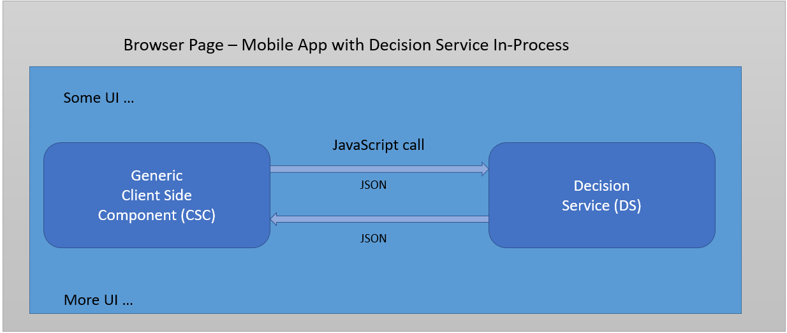
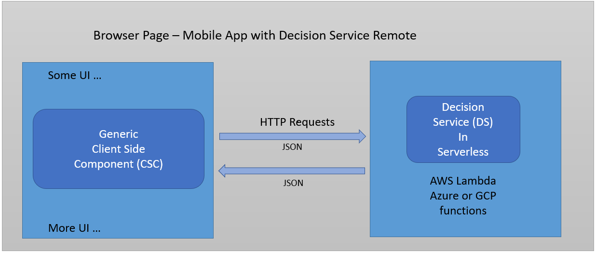

# Local versus Remote Decision Services

Decision services can be run in process within the CSC or maintained in and invoked at a remote environment.

For the remote option, Corticon.js supports deployments to:

-  Any of the major cloud vendors' serverless environments (AWS Lambda, Azure and GCP functions)
-  Node.js servers
-  Traditional Java server running either in the cloud or on premises (traditional server deployments)

In-process deployments provide essentially instant response time, however, there are considerations for when it might make more sense to run maintain this logic in remote environments, such as:

- For Mobile Apps: a decision service hosted remotely can be updated very easily without having to force the user to reinstall the app.
- To address security:
	- Don’t want to expose some of the data used in the decision process.
	- Want to have the decision service access various data sources inside the firewall.
	- Don't want to risk exposing the decision service to reverse engineering.

There are only minor distinctions between how the CSC and decision service interactions take place when running in-process or remotely as illustrated in the 2 diagrams below:

 
 

