<!-- TOC start (generated with https://github.com/derlin/bitdowntoc) -->

- [Defining the Dynamic Form Business Rules in Corticon.js Studio](#defining-the-dynamic-form-business-rules-in-corticonjs-studio)
  - [Dynamic Form Vocabulary Elements and Usage](#dynamic-form-vocabulary-elements-and-usage)
    - [UI](#ui)
      - [pathToData](#pathtodata)
      - [noUItoRender](#nouitorender)
      - [done](#done)
      - [nextStageNumber](#nextstagenumber)
    - [currentStageNumber](#currentstagenumber)
      - [language](#language)
    - [Container](#container)
      - [validationMsg](#validationmsg)
      - [description](#description)
      - [id](#id)
      - [title](#title)
    - [UIControl](#uicontrol)
      - [type](#type)
        - [ReadOnlyText](#readonlytext)
        - [TextArea](#textarea)
        - [Text](#text)
        - [Number](#number)
        - [DateTime](#datetime)
        - [SingleChoice](#singlechoice)
        - [MultipleChoices](#multiplechoices)
        - [MultipleChoicesMultiSelect](#multiplechoicesmultiselect)
        - [MultiText](#multitext)
        - [YesNo](#yesno)
        - [YesNoBoolean](#yesnoboolean)
        - [FileUpload](#fileupload)
        - [MultiExpenses](#multiexpenses)
      - [fieldName](#fieldname)
      - [id](#id-1)
      - [dataSource](#datasource)
      - [emphasize](#emphasize)
      - [max](#max)
      - [min](#min)
      - [minDT](#mindt)
      - [maxDT](#maxdt)
      - [value](#value)
      - [labelPosition](#labelposition)
      - [sortOptions](#sortoptions)
    - [DataSourceOptions](#datasourceoptions)
      - [dataTextField](#datatextfield)
      - [dataValueField](#datavaluefield)
      - [pathToOptionsArray](#pathtooptionsarray)
    - [Option](#option)
      - [displayName](#displayname)
      - [value](#value-1)
    - [BackgroundData](#backgrounddata)
      - [arrayToCollection](#arraytocollection)
      - [arrayToSet](#arraytoset)
      - [collectionName](#collectionname)
      - [fieldName1…fieldName10](#fieldname1fieldname10)
      - [labelName1… labelName10](#labelname1-labelname10)
      - [pathToData1...pathToData10](#pathtodata1pathtodata10)
      - [url](#url)

<!-- TOC end -->

# Defining the Dynamic Form Business Rules in Corticon.js Studio

In Corticon Studio, rules are authored from a "Rule Vocabulary" which translates to a JSON definition when the rules are generated into javascript. There are two aspects involved in the vocabulary for dynamic forms - elements specific to how the form knows what to render, when, and what data to accrue from the end user, and elements specific to the underlying purpose of the form (e.g. a loan applicant's inputs about their needed loan, or insurance claimants' details about a car accident).

There are six vocabulary entities defined currently for the UI definition component when modeling rules. The are: `UI`, `BackgroundData`, `Container`, `DataSourceOptions`, `Option`, `UI`, and `UIControl`. UI is always the root element. Here is the description of these elements:

## Dynamic Form Vocabulary Elements and Usage

### UI

#### pathToData

Data Type: *Any alphanumeric string will be accepted, but
in order to use user-selected responses to dynamically change form behavior in
future steps, this should be set to an entity in the vocabulary that will
accrue the data*

Description: We define which data we want to store by
specifying in the initial stage of the rules which vocabulary entity should
‘store’ the data accrued throughout the form. The stored data can then be
passed along to other workflow steps once the form is complete, or used to
define a conditional rule at a later stage in the form. This is in effect the
bridge between the form behavior component of the vocabulary and the underlying
purpose part of the vocabulary.

Example: when the decision service response to the CSC looks
like:

```
[{"currentStageNumber": 0,"pathToData": "household"}]
```

Then data will be stored under an association called
Household, resulting in the accrued data for user responses being structured
like:

```
[{"currentStageNumber": 0,"pathToData": "household"    },{"household": {"countyfips": "29095","desiredQualityLevel": "3","desiredMetalLevel": "Bronze"}}]
```

All of the entities/associations/attributes accrued under
the pathToData entity are specific to the requirements of a given form, and
thus differ from form to form.

#### noUItoRender


Data Type: Boolean

Description: Set to ‘T’ for any stages where no UI needs to
be rendered, but some action (a decision/calculation/augmentation of separate
rulesheet) needs to be executed. Does not need to be set to ‘F’ when this is
not the case.

#### done


Data Type: Boolean

Description: Upon receiving a done instruction from the
decision service (a notification of the end of the flow) via `UI.done=T`, it is
expected the collected data will be passed to another function or process;
typically an event will be raised with a pointer to the JSON data collected
during the flow.

#### nextStageNumber


Data Type: Integer

Where to specify: **Action**
row of rulesheet

Description: The decision service sets the attribute
`UI.nextStageNumber` to specify the next step in the flow, unless it is the last
stage, in which case this field is left null and done is set to ‘true’

### currentStageNumber


Data Type: Integer

Where to specify: **Filter**
panel of rulesheet, in advanced view

Description: When the client side rendering component is
ready for the next step in the flow, it invokes the decision service by setting
`UI.currentStageNumber` to `UI.nextStageNumber` in the input payload of the
decision service.

#### language

Data Type: String

Description: On start, the rendered can accept the language
from the UI but a decision service may switch the language based on some rules

### Container

Referenced in the rules as: `UI.containers`

Description: For all steps in which something is being
presented to the user (versus just a calculation/decision made in the
background), the decision service will specify the list of UI controls to
render from the decision service JSON payload at the `UI.containers` element.
This is an array of all the containers to render for this stage. The container
can be viewed as a panel containing various labels and input fields. The
container has various attributes, for example a title.

#### validationMsg

Data Type: string

Description: Creates a container wide validation message

#### description

Data Type: String

Description: An optional string that doesn’t impact behavior
of the form. It is mostly useful for troubleshooting.

#### id

Data Type: Any unique String

Description: Required if any container is being rendered.

#### title

Data Type: String

Description: Renders the h3 header on `Container` entity


### UIControl

Referenced in the rules as: `UI.containers.uiControls`

Description: Each UI control element has multiple
attributes. The most important one is the type attribute as it allows the
client-side component to know what kind of control to render and which
necessary attributes to access based on the type. See table below for full
scope of available out of the box options. 

#### type

Description: The specific type of UI Control. Each of these `UIControl` types are created using similar
syntax, though the fields required will vary depending on the type of data
being solicited from the end user (if any). In the out of the box test driver, the following UI Controls / specifications are defined:

##### ReadOnlyText

Read only HTML text

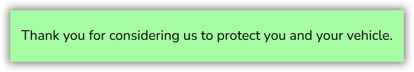

<details open>
  <summary>Rule Syntax</summary> 
  
  `UI.containers.uiControls =
  UIControl.new[type='ReadOnlyText', id='crtl0_1', value = ‘sample’]`
  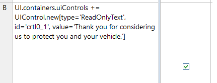

  </details>

##### TextArea

Multilne text input

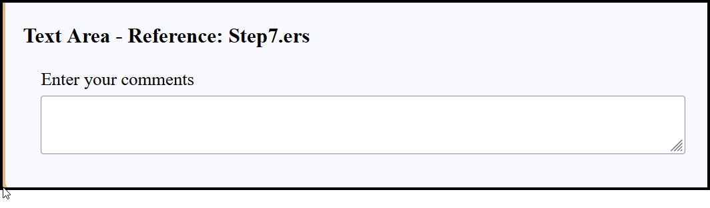

<details open>
  <summary>Rule Syntax</summary> 

`UI.containers.uiControls += UIControl.new[type='TextArea',
id='crtl7_1', fieldName='Step7Field1', label = 'Enter your comments',
labelPosition='Above', cols=80, rows=3, min =5, max = 20]`


  </details>

##### Text

single line text input

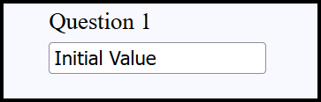

<details open>
  <summary>Rule Syntax</summary> 

`UI.containers.uiControls+=UIControl.new[ type = 'Text', label = 'Street Address', fieldName = 'streetAddress', id = '2', value= '123 Main St']`

 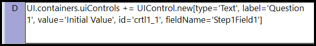

  </details>

##### Number

single number input


<details open>
  <summary>Rule Syntax</summary> 

`UI.containers.uiControls+=UIControl.new [type='Number',
fieldName='age',id='q_1', label = ‘enter your age’]`

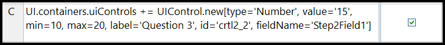


  </details>

##### DateTime

date time or a date input (based on attribute UIControl.showTime)


<details open>
  <summary>Rule Syntax</summary> 
  
  `UI.containers.uiControls+=UIControl.new[type='DateTime', id=cellValue, label=cell Value, fieldName='valueAsDateTime']`
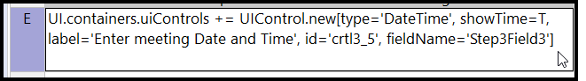

  
  </details>

##### SingleChoice

 Single choice input rendered as a checkbox

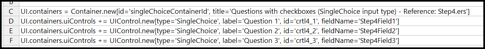

<details open>
  <summary>Rule Syntax</summary> 
  
`UI.containers.uiControls +=
UIControl.new[type='SingleChoice', label=’Check the box if you want',
id='crtl4_1', fieldName='checkboxIsChecked']` 


  </details>

##### MultipleChoices

multi-choice input. The user can only selects one of the choice - typically rendered as a dropdown


<details open>
  <summary>Rule Syntax With Options Defined by Rules</summary>

`UI.containers.uiControls+=UIControl.new [type = 'MultipleChoices', fieldName='sex', id='q_2', label = ‘Please select the sex of the patient’]`

`UI.containers.uiControls.option += Option.new [displayName = 'Male', value = 'M]`

`UI.containers.uiControls.option += Option.new [displayName = 'Female', value = 'F']  ] `

</details>

<details open>
  <summary>Rule Syntax With Options Defined by REST datasource</summary>

(in rulesheet 1/2):

`UI.containers.uiControls+= UIControl.new[type='MultipleChoices', id='crtl2_1', fieldName='make',dataSource ='https://api.npoint.io/d487567c8a34a506350e', label='Please select the make of vehicle']
`

(in rulesheet 2/2, with arrow connector in ruleflow from 1 to 2):

`UI.containers.uiControls.dataSourceOptions = DataSourceOptions.new
[dataValueField = 'brand', dataTextField = 'brand' ]`

</details>


##### MultipleChoicesMultiSelect

Renders a multi-choice input. The user can select 1 to all of the choice.

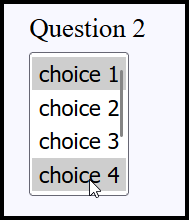

<details open>
  <summary>Rule Syntax</summary>

`UI.containers.uiControls +=
UIControl.new[type='MultipleChoicesMultiSelect', label='Question 2',
id='crtl5_2', fieldName='selections']UI.containers.uiControls.option += Option.new[value='choice1', displayName='choice 1']UI.containers.uiControls.option += Option.new[value='choice2', displayName='choice 2']UI.containers.uiControls.option += Option.new[value='choice3', displayName='choice 3']`

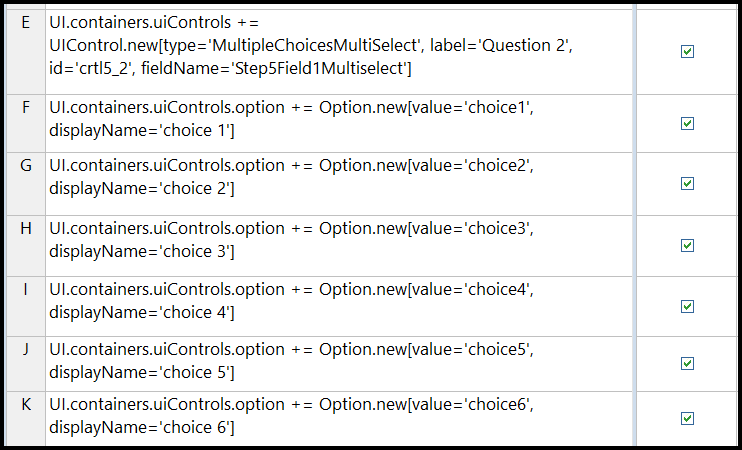


</details>

##### MultiText

for entering a variable number of strings of text. User can hit plus button to add indeterminate number of string entries

<details open>
  <summary>Rule Syntax</summary> 

`UI.containers.uiControls+=UIControl.new[id='multiDrugs', fieldName = 'drugToCover', type = 'MultiText']
`
  </details>

##### YesNo

binary yes - no choice. This is a short cut to creating a multi choices control with yes and no values, with the literal string ‘yes’ or ‘no’ stored as the value

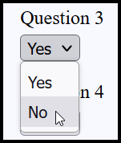

<details open>
  <summary>Rule Syntax</summary> 

`UI.containers.uiControls += UIControl.new[type='YesNo',
label=’ 'Answer yes or no’,  id='crtl1_3', fieldName='response’]`
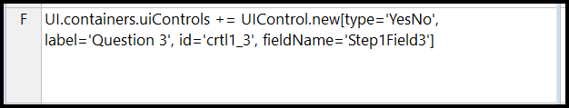

  </details>

##### YesNoBoolean

same as above, but the value stored as T for yes instead of the literal string yes, and F for no.

<details open>
  <summary>Rule Syntax</summary> 
  
`  UI.containers.uiControls+=UIControl.new [type =
'YesNoBoolean', fieldName='onHTN_meds', id='q_3', label = 'Are you on
medication for Hypertension?'] `

  </details>

##### FileUpload

Button to browse desktop for a file to upload
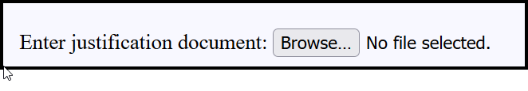

<details open>
  <summary>Rule Syntax</summary> 

`UI.containers.uiControls += UIControl.new[type='FileUpload',
label='Enter justification document', id='crtl6_1', fieldName='Step6Field1'] `

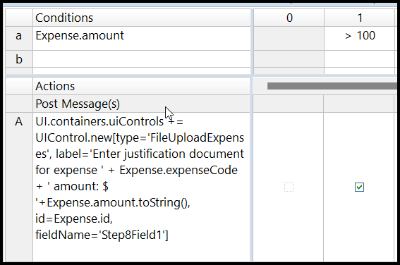

  </details>

##### MultiExpenses

Variable number of input fields (the number of fields chosen by the user filling the form). Intended for logging multiple expenses’ currency, value, and category.


<details open>
  <summary>Rule Syntax</summary> 

`UI.containers.uiControls +=
UIControl.new[type='MultiExpenses', label='Enter all the expenses', id='crtl8_1',  fieldName='Step8Field1']`

`UI.containers.uiControls.option += Option.new[value='hotelCode', displayName='Hotel']`

`UI.containers.uiControls.option += Option.new[value='carRentalCode', displayName='Car Rental']`

`UI.containers.uiControls.option += Option.new[value='airfareCode', displayName='Airfare']`


</details>

#### fieldName

Description: The UI control specifies where to store the
data in the field UIControl.fieldName. For example, if we want to store the value
of a person’s date of birth in a field called dob, within a JSON object called
Person, we would first need to set (either in this stage or a preceding one)
the `UI.pathToData = 'Person'` and then we could define the UI Control’s
`fieldName` to be ‘dob’. This would hold the value selected for the `dob` in the
JSON object as follows:

```
"Person":{
"dob":"MM/DD/YYYY"
}
```

#### id

Data Type: Any unique String

Description: Unique identifier (within the context of one
container) for the UI control.

Example:
` UI.containers.uiControls += UIControl.new [id =
'dietary_restrictions', type = 'MultipleChoices', label =  'Do you have any dietary restrictions?',
fieldName = 'has_dietary_restrictions']`

#### dataSource

Data Type: URL pointing to JSON formatted data

Description: Specifies the datasource to populate
`MultipleChoices` dropdown options from. Value field at the JSON endpoint must
have the key value, display name must have the value displayName. If not the
case for either of these, these can be overridden by specifying a child entity
`DataSourceOptions`.


#### emphasize

Datatype: Boolean

Renders the label of the UI control in bold and colored red. 

#### max

Data Type: Integer

Description: Optionally give the rendering component for
this UI Control a numeric maximum

#### min

Data Type: Integer

Description: Optionally give the rendering component for
this UI Control a minimum numeric value end user can enter


#### minDT

Data Type: Date

Description: Optionally give the rendering component for
this UI Control a minimum date value end user can enter

#### maxDT

Data Type: Date

Description: Optionally give the rendering component for
this UI Control a maximum date value end user can enter

#### value

Data Type: String

Description: For all control types besides `ReadOnlyText`,
optionally give the rendering component for this UI Control a placeholder
default value. For `ReadOnlyText`, this field contains the actual read only text
string to be rendered.


#### labelPosition

Data Type: `‘Above’`, `‘Side’`

Description: Optionally instruct the rendering component
where to place the label for this UI Control

#### sortOptions

Data Type: `‘A to Z’`, `‘Z to A’`

Description: Optionally instruct the rendering component how
to sort the list of options applied to this UI Control

### DataSourceOptions

Referenced in the rules as:
`UI.containers.uiControls.dataSourceOptions`

When using the MultipleChoices UI Control, the actual
choices can be populated from a JSON endpoint or be specified by the rule
modeler. For the first option, the rule modeler must specify a URL on the field
UIControl.dataSource. The default client renderer will look for the options at
that endpoint under the value and displayName field. So if the endpoint looks
like this, then you’re good to go:

```
[{"displayName":"start", "value": "2015-01-01 00:00:00T-0500"},
{"displayName": "end", "value": "2015-12-31 23:59:59T-0500"}]
```
If the JSON data has different keys, the client renderer
must be told which field is going to serve as the value field and which as the
displayName field—these can be, and often are, the same. These are specified
with the `DataSourceOptions` entity.

#### dataTextField

Description: Optionally define the key name to use as the
display name for this option from dropdown, if its name isn’t `displayName`.
Oftentimes this will be the same as the `dataValueField` field.

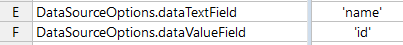

#### dataValueField

Description: Optionally define the name of the key whose
value should be stored should end user select this option from dropdown, if its
name isn’t value. Oftentimes this will be the same as the `dataTextField` field.


#### pathToOptionsArray

Description: Optionally define where in a JSON endpoint is
the array of options to populate a dropdown list with by using JSONPath syntax.
Example: `UI.containers.uiControls.dataSourceOptions.pathToOptionsArray='$.[?(@.brand==
\'' + AutoQuote.vehicle_make + '\' )]'`

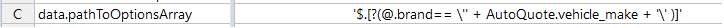


### Option

Referenced in the rules as: `UI.containers.uiControls.option`

Description: When the rule modeler is defining the list of
dropdown options, they can do so with the `Option` entity.

#### displayName

Description: The displayed option within a multiple-choice
dropdown. When selected, it is stored as the corresponding value under the
attribute assigned `UIControl.fieldName`

#### value

Description: The value stored in the `pathToData.fieldName`
when user selects corresponding `displayName`.

### BackgroundData

Referenced in the rules as: `UI.backgroundData`

Used to retrieve data from an external REST JSON endpoint in
cases where the data is being assigned directly to the accrued data, versus
when the external data is referenced and presented as options to the end user
as in the case of the `MultipleChoices` control. It can be used to assign an
individual attribute of the `pathToData` entity from a specific key/value pair,
to create a comma separated string from all of the values for a given key in a
JSON array, or create child associations upon the `pathToData` entity that
mirrors the structure of the endpoint JSON array.

#### arrayToCollection

Boolean. When true, CSC will create child entities upon the
`pathToData` entity. For example, with a `pathToData` set to ‘plan’ and a rule
defined as:

`UI.backgroundData=BackgroundData.newUnique[url=(URL TO A
REST ENDPOINT HERE), arrayToCollection = true,
fieldName1=’benefit’, labelName1=’type’, collectionName='benefit']`

If the specified URL is structured like:
```
[{
    "type": "Routine Dental
Services (Adult)"},
 {"type": "Basic Dental Care -
Child" }]
```

Then the CSC will store the data as:

```
[{
  "plan": [
    {"benefit": "a"},
    {"benefit": "b"}
  ]
}]
```

#### arrayToSet

Similar to above, but if arrayToSet were true instead of arrayToCollection,
then the above scenario would result in data stored like:

```
[{
  "plan": [
    {"benefit": "a, b"},
 ]
}]
```

#### collectionName

Name of the child array under the `pathToData` that will be
created when using `arrayToCollection`

#### fieldName1…fieldName10

Name of attribute under which to ‘store’ the data retrieve
from the labelName specified for the endpoint, with the matching number
(`fieldName1` = `labelName1` etc).

#### labelName1… labelName10

Name of JSON key from which to get value to store under fieldName
with corresponding number (`fieldName1` = `labelName1` etc).

#### pathToData1...pathToData10

JSON path to the desired labelName of the same number (`labelName1`=`pathToData1` etc).

#### url

URL of the JSON endpoint data is being retrieved from
