# Defining Form Behavioral Logic in Corticon.js Studio

Corticon Studio is a standalone desktop environment to model, analyze, test, and save business rules as executable decision services. Corticon 'rule modelers' are commonly business analysts with expertise in the business domain and its policies, using Corticon Studio to define, author, analyze and test rules.

Once satisfied, rules are then deployed as Decision Services onto Corticon Server or as serverless functions with Corticon.js.

This tutorial is focused on skills related to building dynamic forms with Corticon.js. If you're unfamiliar with Corticon but only interested in the dynamic forms use case, below is a brief overview of the core components involved in modeling Corticon business rules. These are just as important to know when building dynamic forms to gather form response data as they are for automating decisions based upon that data.

There are four main steps of building rules in Corticon Studio, culminating in the RuleFlow which will be deployed as a Decision Service.

1.  The first step of the rule modeling process with Corticon is to build the 'dictionary' of business terms used throughout the rules, the **Rule Vocabulary**.
2.  **Rulesheets** are like Decision Tables. Users 'model' the business rules by defining actions to take when specific conditions are met.
3.  Once the rules created in the rulesheet are satisfied, the first **Ruletest** in Corticon Studio can be created to run test data through the rules in the test server embedded in the local application.
4.  From here, you can continue adding more rules to the rulesheet, or more commonly, compartmentalize our rules into different rulesheets, and create a **Ruleflow** to specify the sequence from one rulesheet to another. When multiple Rulesheets are included in a Ruleflow, the Rulesheets will execute in a sequence determined by their Rulesheet order in the Ruleflow.

## Building the Rule Vocabulary 

Typically, a client side component is written and maintained by a developer  while the form's rule-driven logic is written by business analysts who  best understand the subject domain of the form.

The communication between the rule author and front end developer, as well as between the actual artifacts they each produce, is facilitated by a well documented schema for the JSON to exchange IN and OUT.

Corticon business rules are authored in **Corticon.js Studio**, with the backbone of the rules we create being the *Rule Vocabulary*. This will serve as the data model to capture both the  that will define aspects of:
- The user interface (UI), such as which questions to pose to the end user at what stage in the form being filled, and what type of input should be allowed for these questions
- The data needed for the actual decision at hand, which will be captured as a form response and sent along to a downstream application, decision service or system of record

Note that the vocabulary includes every data point involved in the decision/calculation. Some of this data may be passed into the Decision Service when it is called by another application, some of this data may be retrieved by Corticon from an external data source and some of this data may be produced as a result of the rules themselves.

The Client-Side Rendering components is preconfigured to 'know' how to render specific end user prompts based on Corticon.js rules, because it works with the same data model that underlies the rule vocabulary. 

## Rulesheets

Rulesheets are like Decision Tables. Users 'model' the business rules, where the rule is like an ‘if-then’ statement. Each rule consists of one or more conditions (if) that are associated with one or more actions (then). 


## Ruletests

A Ruletest simulates a business scenario where the rules are applied to input data. If the data satisfies all the conditions in a rule, the rule fires and some output containing the results of the rule execution is produced.

You can define different sets of input data to test how the rules behave in different scenarios. You can also use a Ruletest to compare the output of a rule execution with expected results. A Ruletest stores this information in a Ruletest file, enabling you to save use-cases that are of interest, change rules, and run the test again to see how the modified rules behave when applied to the same use-cases. 

## Ruleflows

From here, you can continue adding more rules to the rulesheet, or more commonly, compartmentalize our rules into different rulesheets, and create a Ruleflow to specify the sequence from one rulesheet to another.Ruleflows are both graphical (appearing similar to a flow diagram) and functional (they impact rule behavior, and are ultimately generated into a decision service).

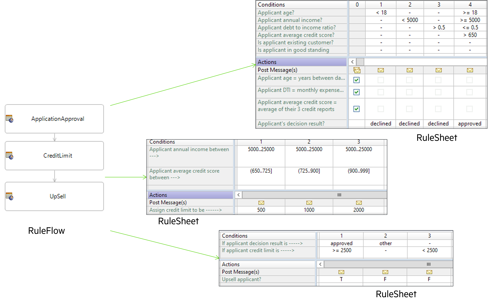


When multiple Rulesheets are included in a Ruleflow, the Rulesheets will execute in a sequence determined by their Rulesheet order in the Ruleflow.

In a typical decision automation use case, rulesheets and ruleflows are 'connected' from one to another when constructing the top level ruleflow. Connections are the objects that connect or “stitch” assets and objects together to control their sequence of execution. 

If a connector is drawn from Rulesheet `sample1.ers` to `sample2.ers`, then when a deployed Ruleflow is invoked, it will execute the rules in `sample1.ers` first, followed by the rules in `sample2.ers`.

For dynamic forms however, instead of a decision that will always go through the same chronology during a single execution, dynamic forms require the ability to navigate throughout the objects in a ruleflow, such that different rules may fire at different times, depending upon dynamic variables. For example, the sequence may be determined based upon:

-   Data that the end user has entered to that point (e.g. to route to different parts of a ruleflow depending upon what type of claim a user has chosen to file)
-    Whether any data is pre-populated at the start of a ruleflow (e.g. leveraging account information specific to the end user as part of the decision for what gets presented in the form)

<table><tr>
<td> 
  <p align="center" style="padding: 10px">
    
    <br>
    <em style="color: grey">Dynamic Form Ruleflow </em>
  </p> 
</td>
<td> 
  <p align="center">
    
    <br>
    <em style="color: grey">Typical, Connected Ruleflow</em>
  </p> 
</td>
</tr></table>

## What the Client Side Component needs from the rules

The decision service informs the front end UI each and every prompt to present to the user, throughout the form. It likewise may define whether to execute a decision/computation in the background before moving on to subsequent stages. 

The content presented in the form at a given point can define different paths depending upon
 * Previously entered data data entry to make decisions. For example, the form may branch to a different step, or specify different UI controls 
 * The output of decisions and computations performed between steps
 * Data already known about the end user, for example data populated from an external CRM system

There are certain rules which are useful to implement only at the start or end of the form. For example, telling the CSC where to store the accrued form data, and telling the CSC when the form is complete.

## Working with Corticon.js Studio file types to build Dynamic Forms

The main functions of the rules throughout a form's ruleflow, from which the Decision Service will be generated, are to define:

1.  The sequence of the questions (What prompt is presented when and base upon what).
2.  For each step, either:
  - What user prompt to render (e.g. dropdown, true/false, number, etc). Henceforth, we refer to these user prompts as **UI Controls**. 
	- Execute some business logic or computation that doesn't involve presenting anything to the user (e.g. add together dollar amount of all expenses being submitted)
3. Which data should be retained and accrued to pass along upon form completion, versus which data is only relevant ephemerally (e.g., assigning data related to a claim to be retained, while assigning the response to '_Do you have more claims to submit_?' to be discarded. 

# Using the Template Vocabulary

In order for the front end UI to know how to interpret a message from the decision service, they must work from the same data model. In the pre-built template form, all of the following data elements can be used when building the rules, and the front end component will understand the directions.

## UI


Description: The entity UI is the ‘parent’ entity, returned at index 0, which will guide things like where we are in the form, when the form is complete, and where to store the accrued data. See table below for full scope of available out of the box options. Items with an asterisk are required.


### pathToData


Data Type: _Any alphanumeric string will be accepted, but in order to use user-selected responses to dynamically change form behavior in future steps, this should be set to an entity in the vocabulary that will accrue the data_
  
Description: We define which data we want to store by specifying in the initial stage of the rules which vocabulary entity should ‘store’ the data accrued throughout the form. This is specified with `UI.pathToData` in an initial stage, in this case, it will be the `AutoQuote` entity. The `pathToData` entity will be at index 1 in the JSON. The stored data can then be passed along to other workflow steps once the form is complete, or used to define a conditional rule at a later stage in the form.


### noUiToRenderContinue


Data Type: _T/F_


Description: Set to ‘T’ for any stages where no UI needs to be rendered, but some action (a decision/calculation/augmentation of separate rulesheet) needs to be executed. Does not need to be set to ‘F’ when this is not the case.


```hover mouse to copy
UI.noUItoRender
```

### done


Data Type: _T/F_

Description: Upon receiving a done instruction from the decision service (a notification of the end of the flow) via `UI.done=T`, it is expected the collected data will be passed to another function or process; typically an event will be raised with a pointer to the JSON data collected during the flow.


### **Rule Definition**


### **Copy these rules**

```
UI.done
```

### nextStageNumber


Data Type: _Integer_

Where to specify: **Action** row of rulesheet

Description: The decision service sets the attribute `UI.nextStageNumber` to specify the next step in the flow, unless it is the last stage, in which case this field is left null and done is set to ‘true’


### currentStageNumber


Data Type: _Integer_

Where to specify: **Filter** panel of rulesheet, in advanced view

Description: When the client side rendering component is ready for the next step in the flow, it invokes the decision service by setting UI.currentStageNumber to `UI.nextStageNumber` in the input payload of the decision service.


###  Language

Data Type: _String_

Description: On start, the rendered can accept the language from the UI but a decision service may switch the language based on some rules

---


## Container 
`UI.containers`

Description: For all steps in which something is being presented to the user (versus just a calculation/decision made in the background), the decision service will specify the list of UI controls to render from the decision service JSON payload at the UI.containers element. This is an array of all the containers to render for this stage. The container can be viewed as a panel containing various labels and input fields. The container has various attributes, for example a title.


### validationMsg


Data Type: _Alphanumeric string_

Description: Creates a container wide validation message


### description

Data Type: _Alphanumeric string_

Description: An optional string that doesn’t impact behavior of the form. It is mostly useful for troubleshooting.


### id


Data Type: _Any unique alphanumeric string_

Description: Required if any container is being rendered.


### title


Data Type: _Alphanumeric string_

Description: Renders the h3 header on Container entity


---


## UIControl 
`UI.containers.uiControls`

Description: Each UI control element has multiple attributes. The most important one is the type attribute as it allows the client-side component to know what kind of control to render and which necessary attributes to access based on the type. See table below for full scope of available out of the box options. Items with an asterisk are required.


### type


Description: The specific type of UI Control. In the out of the box test driver, the following UI Controls / specifications are defined:

- `type = ‘Text’`

   Description:    Single line text field input


### **Rule Definition**

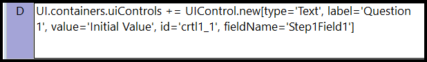

### **Rendered Rules**


- `type = ‘TextArea’`
  
  Description:   Multi-lines text input

### **Rule Definition**


### **Rendered Rules**

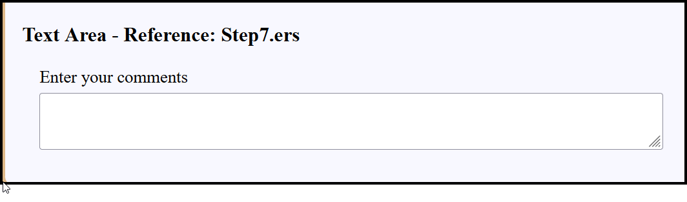

- `type = ‘SingleChoice’`
  
   Description:    Renders as a checkbox with value stored as T/F
    
### **Rule Definition**


### **Rendered Rules**


- `type = ‘MultipleChoices’`

   Description:  Multiple choice dropdown. Options must be specified either by pointing to a JSON datasource or defining the options in a subsequent rulesheet.
    

### **Rule Definition**


### **Rendered Rules**

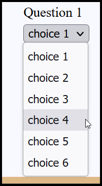


- `type = ‘Number’`

  Description:   Single number input
    

### **Rule Definition**


### **Rendered Rules**

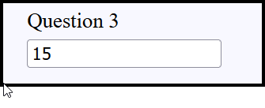


- `type = ‘DateTime’`

  Description:   Date picker
    

### **Rule Definition**

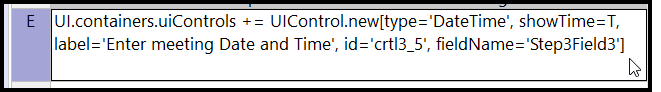

### **Rendered Rules**

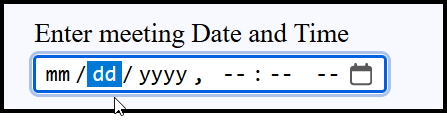


- `type = ‘ReadOnlyText’`

   Description:  A control to render HTML text


### **Rule Definition**


### **Rendered Rules**


- `type = ‘YesNo’`

  Description:   Dropdown of Yes or No, stored as Yes or No
    
    

### **Rule Definition**

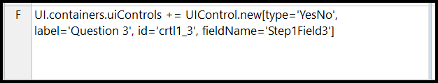

### **Rendered Rules**


- `type = ‘YesNoBoolean’`

  Description:   Dropdown of Yes or No, stored as T or F
    

### **Rule Definition**


### **Rendered Rules**


- `type = ‘FileUpload’`

   - Description:  A control to render a file upload control.
    

### **Rule Definition**

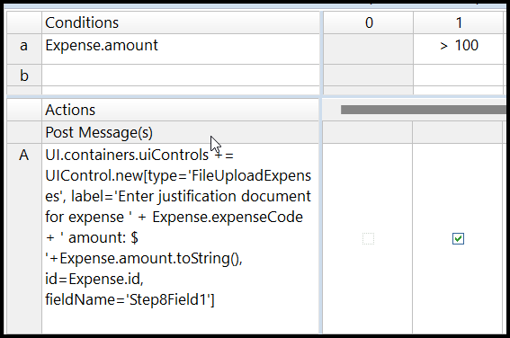

### **Rendered Rules**

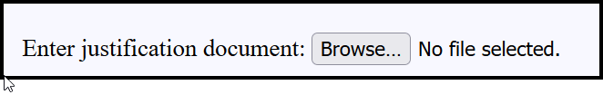


- `type = ‘MultiExpenses’`

   Description:  List of financial line items. It contain 3 primitive UI elements: an expense type selector, an expense amount input and a currency selector.


### **Rule Definition**


### **Rendered Rules**


- `type = ‘MultipleChoicesMultiSelect’`

    Description: Similar to MultipleChoices, but allows for multiple selected options


### **Rule Definition**


### **Rendered Rules**

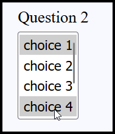

### **Copy these rules**
```hover mouse to copy
UI.containers.uiControls += UIControl.new[type='MultiExpenses', label='Enter all the expenses', id='crtl8_1', fieldName='Step8Field1']
UI.containers.uiControls.option += Option.new[value='hotelCode', displayName='Hotel']
UI.containers.uiControls.option += Option.new[value='carRentalCode', displayName='Car Rental']
UI.containers.uiControls.option += Option.new[value='airfareCode', displayName='Airfare']

UI.nextStageNumber
UI.currentStageDescription = 'This is implemented in Step8.ers' 

```


### fieldName


`fieldName = entity_assigned_as_pathToData.attribute`

   Description: The UI control specifies where to store the data in the field UIControl.fieldName. For example, if we want to store the value of a person’s date of birth in a field called dob, within a JSON object called `Person`, we would first need to set (either in this stage or a preceding one) the `UI.pathToData = 'Person'` and then we could define the UI Control’s `fieldName` to be ‘dob’. This would hold the value selected for the dob in the JSON object as follows: 

   `"Person":{
      "dob":"MM/DD/YYYY"
   }`


### id


Data Type: _Any unique alphanumeric string_

Description: Unique identifier (within the context of one container) for the UI control.


Example: `UI.containers.uiControls += UIControl.new [id = 'dietary_restrictions', type = 'MultipleChoices', label =  'Do you have any dietary restrictions?', fieldName = 'has_dietary_restrictions']`


### dataSource


Data Type: _URL pointing to JSON formatted data_

Description: Specifies the datasource to populate MultipleChoices dropdown options from. Value field at the JSON endpoint must have the key value, display name must have the value `displayName`. If not the case for either of these, these can be overridden by specifying a child entity `‘DataSourceOptions’`


### max


Data Type: _Integer_

Description: Optionally give the rendering component for this UI Control a numeric maximum


### min


Data Type: _Integer_

Description: Optionally give the rendering component for this UI Control a minimum numeric value end user can enter


### minDT


Data Type: _Date_

Description: Optionally give the rendering component for this UI Control a minimum date value end user can enter


### maxDT


Data Type: _Date_

Description: Optionally give the rendering component for this UI Control a maximum date value end user can enter


[](../images/maxDt.png)


###  defaultValue


Data Type: _Alphanumeric string_

Description: Optionally give the rendering component for this UI Control a placeholder default value


### multiple


Data Type: _T/F_

Description: When there could be any number of responses to a prompt, set this to true. The answers are stored in an array pointed as specified by `fieldName` attribute.


### tooltip


Data Type: _Alphanumeric string_

Description: Optionally give the rendering component for this UI Control a tooltip to assist end user


### label


Data Type: _Alphanumeric string_

Description: Content of the prompt provided by the UI Control


### rows


Data Type: _integer_

Description: HTML textarea rows attribute


### required


Data Type: _T/F_

Description: Whether the user filling out the form is required to respond to this prompt


### validationErrorMsg


Data Type: _Alphanumeric string_

Description: Creates validation message for individual UI Control


### cols


Data Type: _integer_

Description: HTML textarea cols attribute


### value


Data Type: _Alphanumeric string_

Description: The content of a `ReadOnlyText` UI Control


###  labelPosition


Data Type: _‘Above’, ‘Side’_

Description: Optionally instruct the rendering component where to place the `label` for this UI Control


### sortOptions


Data Type: _‘A to Z’, ‘Z to A’_

Description: Optionally instruct the rendering component how to sort the list of options applied to this UI Control

## DataSourceOptions
 `UI.containers.uiControls.dataSourceOptions`

   When using the MultipleChoices UI Control, the actual choices can be populated from a JSON endpoint or be specified by the rule modeler. For the first option, the rule modeler must specify a URL on the field `UIControl.dataSource`. The default client renderer will look for the options at that endpoint under the `value` and `displayName` field. So if the endpoint looks like this, then you’re good to go:


  If the JSON data has different keys, such as shown below, the client renderer must be told which field is going to serve as the value field and which as the displayName field—these can be, and often are, the same. These are specified with the DataSourceOptions entity.


---


### dataTextField


Description: Optionally define the key name to use as the display name for this option from dropdown, if its name isn’t `displayName`. Oftentimes this will be the same as the `dataValueField` field.


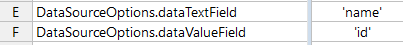


### dataValueField


Description: Optionally define the name of the key whose value should be stored should end user select this option from dropdown, if its name isn’t value. Oftentimes this will be the same as the `dataTextField` field.


### pathToOptionsArray


Description: Optionally define where in a JSON endpoint is the array of options to populate a dropdown list with by using JSONPath syntax.


### **Rule Definition**


### **Copy this rule**
```
data.pathToOptionsArray='$.[?(@.brand== \'' + AutoQuote.vehicle_make + '\' )]'
```


## Option 
`UI.containers.uiControls.option`

Description: When the rule modeler is defining the list of dropdown options, they can do so with the `Option` entity.


### displayName


Description: The displayed option within a multiple-choice dropdown. When selected, it is stored as the corresponding value under the attribute assigned `UIControl.fieldName`


### value


Description: The value stored in the `pathToData.fieldName` when user selects corresponding displayName.


# Sequence Of Form Stages

The mechanism through which we identify when to render a given prompt  to the end user is the stageNumber.

Dynamic forms do not progress linearly—
every time content is rendered to the form end user, that content is rendered because the stage specified by the Client has been matched with a rulesheet that filters out all stages except the one specified. 

The rules will tell the front end what to present at each stage, as well as what the stage number should be set to the next time the user hits 'next'.

