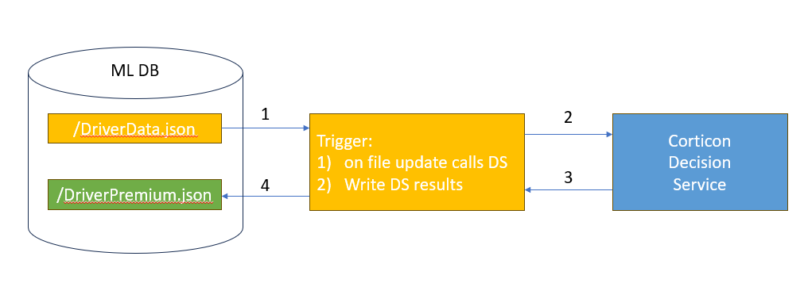
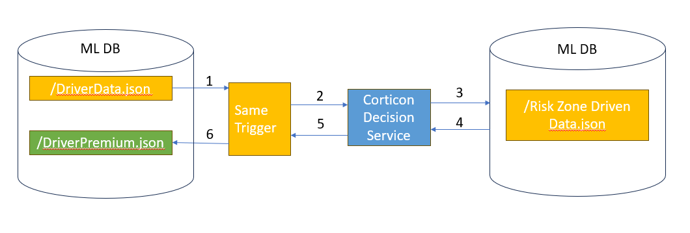

# Introduction

This sample shows a simplified daily car insurance price calculation.  
The decision service computes the daily premium based on various attributes like driver's age, distance driven, risk of the zone driven, ect.

# Demo Scenarios

The project can be used to demo many Corticon concepts. It has simple rulesheets and ruleflows to show the basic constructs rule modelers work with.

In "Calculate Daily Insurance Per Distance Driven.ers", rule 12 (column 12) can be used to show the power of conflict checker.

"Adjust Daily Insurance Based On Zone Driven.ers" has a pre-condition filter: it will trigger only if the distance driven for the day is more than 0.

The project contains multiple ruleflows to demo in various target environments like browser, Serverless and MarkLogic.
Specifically:

1) Calculate Daily Insurance.erf: is very generic and can be used with any target environment.  All data is passed to the Corticon decision service at once.
   Data can contain a single or multiple drivers to process in a single call.
2) Calculate Daily Insurance With SCO.erf: is specific to MarkLogic.  It is identical to the generic one, but it contains an additional step to retrieve the zone driven from an additional data document in MarkLogic

## Demos with MarkLogic

One can setup a MarkLogic trigger to execute the Corticon decision service on document change or create.
See https://github.com/corticon/corticon.js-samples/blob/master/Importable-Rule-Projects/DailyInsurance/_MarkLogicTrigger/trigger.txt for an example on
what the trigger code looks like.

The next sections illustrate various patterns on how Corticon Decision Services can be used with MarkLogic

### All Data Passed In

Here the MarkLogic document causing the trigger to fire contains all the data necessary for the decision service to reach its conclusion.

### Data Retrieval on Demand

In this pattern, we show how not all the data needs to be passed at once and how the Corticon decision service retrieves additional 
data as part of its rules via a service callout.  This is particularly advantageous as the data retrieval can be triggered conditionally
thus optimizing performance, network traffic and overall cost.

For example, here we retrieve the risk level for zone driven during the day.

