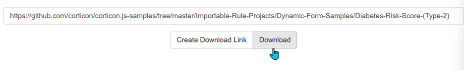
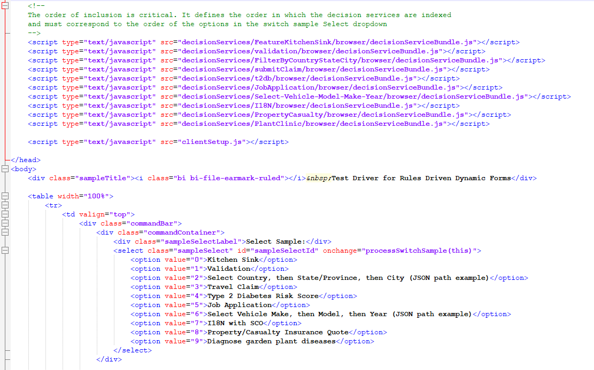

## Steps to import and run dynamic form samples

1. GitHub doesn't allow the downloading of a specific directory within a repository—they make you download the whole repo, or just 1 file. To get around this, you can use the free utility, DownGit. Just paste the URL of the directory within the repository you would like to download locally, and click download. We'll use the Diabetes Risk Score as an example:

2.	Save the zip file to a directory that will be easy to remember like C\projects. Don't unzip it. 

3.	In Corticon.js Studio, click File > Import > General > Existing Projects into Workspace:

4.	In the step page of the wizard, select the option 'Select archive file:', then browse to the location of the downloaded zip file:

5.	Click finish. You should see the imported project in your project explorer in Corticon.js Studio. 

6.	Next, we need to download the 'Test Drive' rendered from the same repository. Copy the URL of the Test Driver directory AKA the Client Side Component (CSC) from the CSC folder, and download it from DownGit. This time, unzip the file to a folder like C\Projects\CSC. To keep things tidy, it's best to make sure that this folder only contains the CSC content, separate from other files in the folder. 

7.	Back in Corticon.js Studio, right click the name of the 'top level' ruleflow which contains all of the form behavior logic. In the Diabetes Risk project, this is called 't2db.erf'. Click 'Package Rules for Deployment':

8.	In the wizard that opens, select 'Browser' from the 'Target platform:' dropdown, then double check that the 'Bundle name' matches the name of the ruleflow. For the 'To directory:', click browse, navigate to the CSC folder you imported, single click the 'decisionServices' subdirectory, and click 'Select Folder'. The selected directory in the package and deploy wizard should end with '\CSC\decisionServices'. This location will be remembered the next time you run the wizard, but it's important to point to the right directory this first time. 

9.	Click 'Finish' (the configuration options in the next step of the wizard aren't necessary at this point). You should get the popup if successful:

10.	Back in the CSC folder within your file explorer, double click client.html to open the Test Driver in your browser. The 'Type 2 Diabetes Risk Score' option in the dropdown will now reference the decision service bundle you just created. 

## If you want to change/add to the samples 
There are two necessary tweaks to ensure the Test Driver knows how to access the decision service bundle. 

1. When you generated the decision service in the preceding steps, Corticon.js placed the javascript bundle into the CSC subdirectory CSC\decisionServices\t2db\browser. The 't2db' part is important here-if you were to create a new form, generated from a ruleflow called 'test.erf', then you need to configure the test driver to use the javascript bundle that would be placed in the CSC subdirectory CSC\decisionServices\test\browser.
   
2. This folder is specified in two places within the client.html file that you ran in the browser. Navigate back to this file in the file explorer, but this time, right click and select open in notepad. 
   
3. Scroll about halfway down to get to this section:

4. The test driver knows _which_ samples to reference based upon the order in which the decision service is listed as a script. The options displayed in the dropdown in the test driver are based upon the lower half of the screenshot, which needs to correspond in order with the decision service it references above. So, if we wanted to add the 'test' dynamic form instead of the t2db form, we could tweak the HTML as shown below (assuming you generated the javascript bundle from the Package and Deploy wizard like before.)
