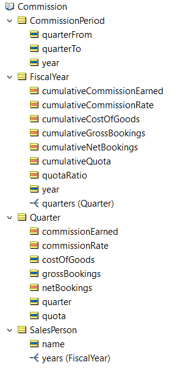
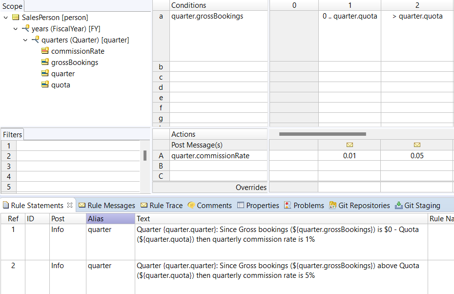
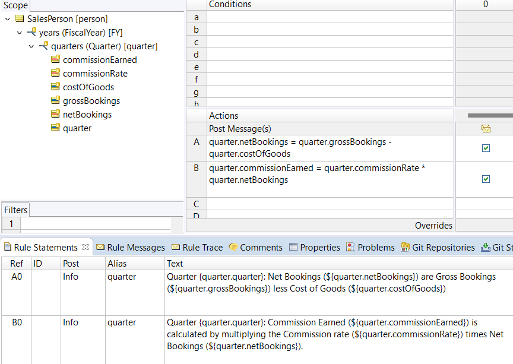
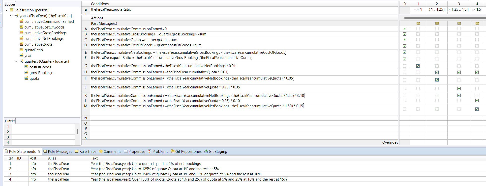
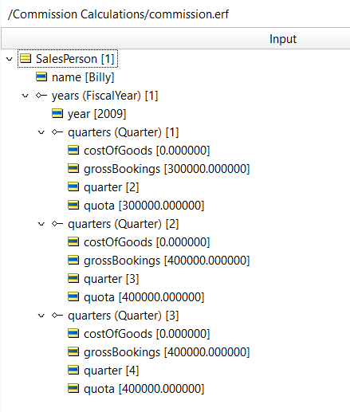
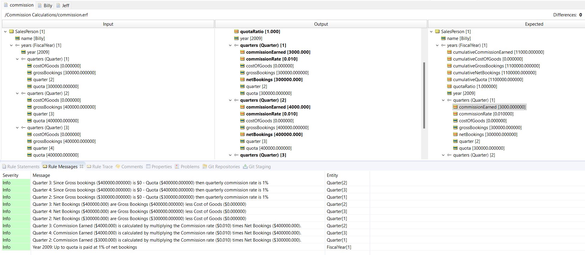

Calculate sales commission payments

---
[Download Rule Assets](https://github.com/corticon/accelerators/raw/main/docs/classic-templates/project-zips/Commission%20Calculations.zip)

---

_This example illustrates how sales commissions can be calculated using a tiering system whereby sales over quota are rewarded at higher commission rates_

The Rules:

* If Quarterly Gross bookings are $0 ‐ Quota then quarterly commission rate is 1%
* If Quarterly Gross bookings are above Quota then quarterly commission rate is 5%
* Quarterly Net Bookings are Gross Bookings less Cost of Goods
* Quarter Commission Earned is calculated by multiplying the quarterly Commission rate times Quarterly Net Bookings
* Cumulative net bookings up to quota are paid at 1%
* Cumulative net bookings up to 125% of quota: Quota at 1% and the rest at 5%
* Cumulative net bookings up to 150% of quota: Quota at 1% and 25% of quota at 5% and the rest at 10% 
* Cumulative net bookings over 150% of quota: Quota at 1% and 25% of quota at 5% and 25% at 10% and the rest at 15%

## Rule Vocabulary

## Calculating the quarterly commission rate

## Calculating the quarterly commission

## Calculating cumulative commission

## Test Case

## Test Results

