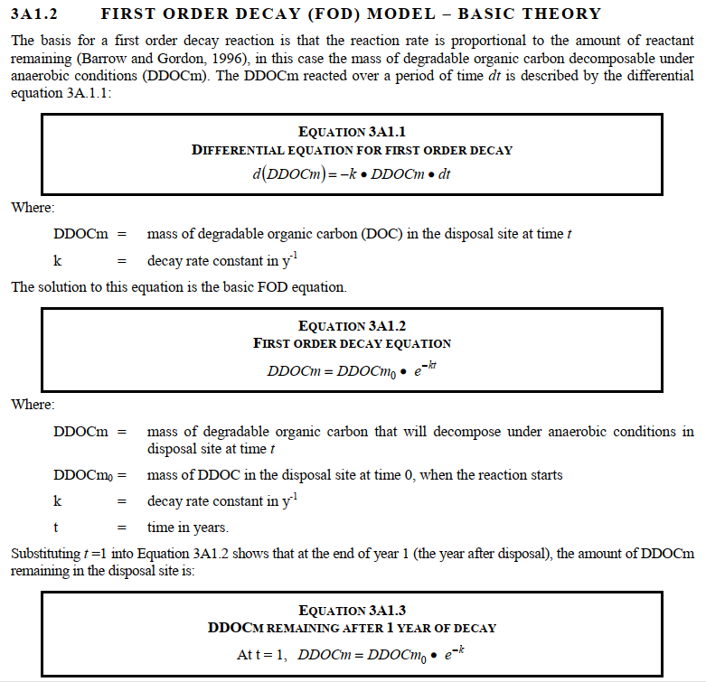
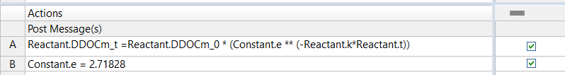
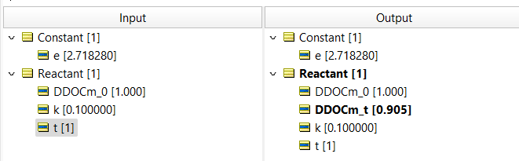

# First Order of Decay Calculations 
_How long for hazardous waste to decay to a safe level?_

First Order of Decay Calculations are [widely used](https://pubmed.ncbi.nlm.nih.gov/27332778/) to estimate landfill gas generation for emissions inventories, life cycle assessments, and regulation. It is the methodological tool advised by the United Nations Framework Covention on Climate Change for the calculation of solid waste disposal site emissions. 

With Corticon, using two rules, we can create a web service or JavaScript function that will automatically ingest the inputs and execute this calculation. These rules leverage this specification from the UN's Intergovernmental Panel on Climate Change:

Equation 2A1.2 Expressed in Corticon
 

Result from Corticon = 90.48 

