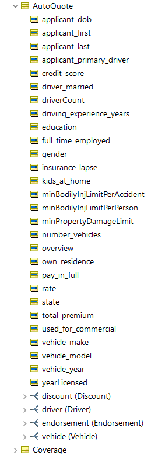
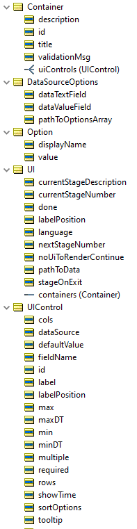

# Building the Data Model
We can use Corticon.js Studio to model business rules to define both the dynamic form’s behavior and the eligibility/qualification rules. First, we define a unified data model—the Rule Vocabulary—that captures:

- The underwriters’ mental model of necessary data points for evaluating the applicant
- The user experience team’s vision for the logic and steps involved throughout the form’s user interface   

When working with this model in Corticon.js Studio, it is referred to as a Rule Vocabulary, but once we compile the rules into a JavaScript file, the Rule Vocabulary is translated into the JSON schema used to communicate between the front-end rendering component and the embedded business rules.

|**Rule Vocabulary - Quote Details Section**|**Rule Vocabulary - Dynamic Forms Section**|
| :-: | :-: | 
| |  |

