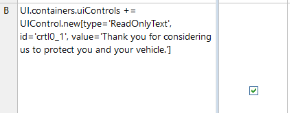
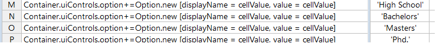

# Form Behavior Schema

<!-- panels:start -->

<!-- div:title-panel -->

## UI

<!-- div:left-panel -->

The entity UI is the ‘parent’ entity, returned at index 0, which will guide things like where we are in the form, when the form is complete, and where to store the accrued data. See table below for full scope of available out of the box options. Items with an asterisk are required.

<!-- div:title-panel -->

### pathToData

<!-- div:left-panel -->

_Any alphanumeric string will be accepted, but in order to use user-selected responses to dynamically change form behavior in future steps, this should be set to an entity in the vocabulary that will accrue the data_

We define which data we want to store by specifying in the initial stage of the rules which vocabulary entity should ‘store’ the data accrued throughout the form. This is specified with UI.pathToData in an initial stage, in this case, it will be the AutoQuote entity. The pathToData entity will be at index 1 in the JSON. The stored data can then be passed along to other workflow steps once the form is complete, or used to define a conditional rule at a later stage in the form.

<!-- div:right-panel -->

<!-- div:title-panel -->

### noUiToRenderContinue

<!-- div:left-panel -->

_T/F_

Set to ‘T’ for any stages where no UI needs to be rendered, but some action (a decision/calculation/augmentation of separate rulesheet) needs to be executed. Does not need to be set to ‘F’ when this is not the case.

<!-- div:right-panel -->

<!-- div:title-panel -->

### done

<!-- div:left-panel -->

_T/F_

Upon receiving a done instruction from the decision service (a notification of the end of the flow) via UI.done=T, it is expected the collected data will be passed to another function or process; typically an event will be raised with a pointer to the JSON data collected during the flow.

<!-- div:right-panel -->

<!-- div:title-panel -->

### nextStageNumber

<!-- div:left-panel -->

_Integer_

The decision service sets the attribute UI.nextStageNumber to specify the next step in the flow, unless it is the last stage, in which case this field is left null and done is set to ‘true’

<!-- div:right-panel -->

<!-- div:title-panel -->

### currentStageNumber

<!-- div:left-panel -->

_Integer_

When the client side rendering component is ready for the next step in the flow, it invokes the decision service by setting UI.currentStageNumber to UI.nextStageNumber in the input payload of the decision service.

<!-- div:right-panel -->

<!-- div:title-panel -->

###  Language

<!-- div:left-panel -->

_String_

On start, the rendered can accept the language from the UI but a decision service may switch the language based on some rules

---

<!-- div:title-panel -->

## Container (UI.containers)
<!-- div:left-panel -->

For all steps in which something is being presented to the user (versus just a calculation/decision made in the background), the decision service will specify the list of UI controls to render from the decision service JSON payload at the UI.containers element. This is an array of all the containers to render for this stage. The container can be viewed as a panel containing various labels and input fields. The container has various attributes, for example a title.

<!-- div:title-panel -->

### validationMsg
<!-- div:left-panel -->

_Alphanumeric string_

Creates a container wide validation message

<!-- div:title-panel -->

### description
<!-- div:left-panel -->

_Alphanumeric string_

An optional string that doesn’t impact behavior of the form. It is mostly useful for troubleshooting.

<!-- div:title-panel -->

### id

<!-- div:left-panel -->

_Any unique alphanumeric string_

Required if any container is being rendered.

<!-- div:title-panel -->

### title

<!-- div:left-panel -->

_Alphanumeric string_

h3 header on Container

<!-- div:right-panel -->

---

<!-- div:title-panel -->

## UIControl (UI.containers.uiControls)

<!-- div:left-panel -->

Each UI control element has multiple attributes. The most important one is the type attribute as it allows the client-side component to know what kind of control to render and which necessary attributes to access based on the type. See table below for full scope of available out of the box options. Items with an asterisk are required.

<!-- div:title-panel -->

### type

<!-- div:left-panel -->

The specific type of UI Control. In the out of the box test driver, the following UI Controls / specifications are defined:

- _type = ‘Text’_
    Single line text field input
- _type = ‘TextArea’_
    Multi-lines text input
- _type = ‘SingleChoice’_
    Renders as a checkbox with value stored as T/F
- _type = ‘MultipleChoices’_
    Multiple choice dropdown. Options must be specified either by pointing to a JSON datasource or defining the options in a subsequent rulesheet.
- _type = ‘Number’_
    Single number input
- _type = ‘DateTime’_
    Date picker
- _type = ‘ReadOnlyText’_
    A control to render HTML text
- _type = ‘YesNo’_
    Dropdown of Yes or No, stored as Yes or No
- _type = ‘YesNoBoolean’_
    Dropdown of Yes or No, stored as T or F
- _type = ‘FileUpload’_
    A control to render a file upload control.

        <!-- tabs:start -->

            #### **Rule Definition**

            

            #### **Rendered Rules**

            

        <!-- tabs:end -->

<!-- div:left-panel -->

- _type = ‘MultiExpenses’_
    List of financial line items. It contain 3 primitive UI elements: an expense type selector, an expense amount input and a currency selector.
- _type = ‘MultipleChoicesMultiSelect’_
    Similar to MultipleChoices, but allows for multiple selected options

<!-- div:title-panel -->

### fieldName

<!-- div:left-panel -->

_fieldName = entity\_assigned\_as\_pathToData.attribute_

The UI control specifies where to store the data in the field UIControl.fieldName. For example, if we want to store the value of a person’s date of birth in a field called dob, within a JSON object called Person, we would first need to set (either in this stage or a preceding one) the UI.pathToData = 'Person' and then we could define the UI Control’s fieldName to be ‘dob’. This would hold the value selected for the dob in the JSON object as follows: "Person" : { "dob" : "MM/DD/YYYY" }

<!-- div:title-panel -->

### id

<!-- div:left-panel -->

_Any unique alphanumeric string_

Unique identifier (within the context of one container) for the UI control.

<!-- div:title-panel -->

### dataSource

<!-- div:left-panel -->

_URL pointing to JSON formatted data_

Specifies the datasource to populate MultipleChoices dropdown options from. Value field at the JSON endpoint must have the key value, display name must have the value displayName. If not the case for either of these, these can be overridden by specifying a child entity ‘DataSourceOptions’

<!-- div:right-panel -->

<!-- div:title-panel -->

### max

<!-- div:left-panel -->

_Integer_

Optionally give the rendering component for this UI Control a numeric maximum

<!-- div:title-panel -->

### min

<!-- div:left-panel -->

_Integer_

Optionally give the rendering component for this UI Control a minimum numeric value end user can enter

<!-- div:right-panel -->

<!-- div:title-panel -->

### minDT

<!-- div:left-panel -->

_Date_

Optionally give the rendering component for this UI Control a minimum date value end user can enter

<!-- div:title-panel -->

### maxDT

<!-- div:left-panel -->

_Date_

Optionally give the rendering component for this UI Control a maximum date value end user can enter

<!-- div:right-panel -->

<!-- div:title-panel -->

###  defaultValue

<!-- div:left-panel -->

_Alphanumeric string_

Optionally give the rendering component for this UI Control a placeholder default value

<!-- div:title-panel -->

### multiple

<!-- div:left-panel -->

_T/F_

When there could be any number of responses to a prompt, set this to true. The answers are stored in an array pointed as specified by fieldName attribute.

<!-- div:title-panel -->

### tooltip

<!-- div:left-panel -->

_Alphanumeric string_

Optionally give the rendering component for this UI Control a tooltip to assist end user

<!-- div:title-panel -->

### label

<!-- div:left-panel -->

_Alphanumeric string_

Content of the prompt provided by the UI Control

<!-- div:title-panel -->

### rows

<!-- div:left-panel -->

_integer_

HTML textarea rows attribute

<!-- div:title-panel -->

### required

<!-- div:left-panel -->

_T/F_

Whether the user filling out the form is required to respond to this prompt

<!-- div:title-panel -->

### validationErrorMsg

<!-- div:left-panel -->

_Alphanumeric string_

Creates validation message for individual UI Control

<!-- div:title-panel -->

### cols

<!-- div:left-panel -->

_integer_

HTML textarea cols attribute

<!-- div:title-panel -->

### value

<!-- div:left-panel -->

_Alphanumeric string_

The content of a ReadOnlyText UI Control

<!-- div:right-panel -->

<!-- div:title-panel -->

###  labelPosition

<!-- div:left-panel -->

_‘Above’, ‘Side’_

Optionally instruct the rendering component where to place the label for this UI Control

<!-- div:title-panel -->

### sortOptions

<!-- div:left-panel -->

_‘A to Z’, ‘Z to A’_

Optionally instruct the rendering component how to sort the list of options applied to this UI Control

When using the MultipleChoices UI Control, the actual choices can be populated from a JSON endpoint or be specified by the rule modeler. For the first option, the rule modeler must specify a URL on the field UIControl.dataSource. The default client renderer will look for the options at that endpoint under the value and displayName field. So if the endpoint looks like this, then you’re good to go:

<!-- div:right-panel -->

<!-- div:left-panel -->

If the JSON data has different keys, such as shown below, the client renderer must be told which field is going to serve as the value field and which as the displayName field—these can be, and often are, the same. These are specified with the DataSourceOptions entity.

<!-- div:right-panel -->

---

<!-- div:title-panel -->

## DataSourceOptions (UI.containers.uiControls.dataSourceOptions)

<!-- div:title-panel -->

### dataTextField

<!-- div:left-panel -->

Optionally define the key name to use as the display name for this option from dropdown, if its name isn’t displayName. Oftentimes this will be the same as the dataValueField field.

<!-- div:right-panel -->

<!-- div:title-panel -->

### dataValueField

<!-- div:left-panel -->

Optionally define the name of the key whose value should be stored should end user select this option from dropdown, if its name isn’t value. Oftentimes this will be the same as the dataTextField field.

<!-- div:right-panel -->

<!-- div:title-panel -->

### pathToOptionsArray

<!-- div:left-panel -->

Optionally define where in a JSON endpoint is the array of options to populate a dropdown list with

<!-- div:right-panel -->

When the rule modeler is defining the list of dropdown options, they can do so with the Option entity.

---
<!-- div:title-panel -->

## Option (UI.containers.uiControls.option)

<!-- div:title-panel -->

### displayName

<!-- div:left-panel -->

The displayed option within a multiple-choice dropdown. When selected, it is stored as the corresponding value under the attribute assigned UIControl.fieldName

<!-- div:title-panel -->

### value

<!-- div:left-panel -->

The value stored in the pathToData.fieldName when user selects corresponding displayName.

<!-- div:right-panel -->

<!-- panels:end -->