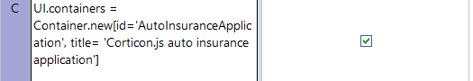
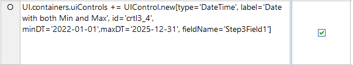
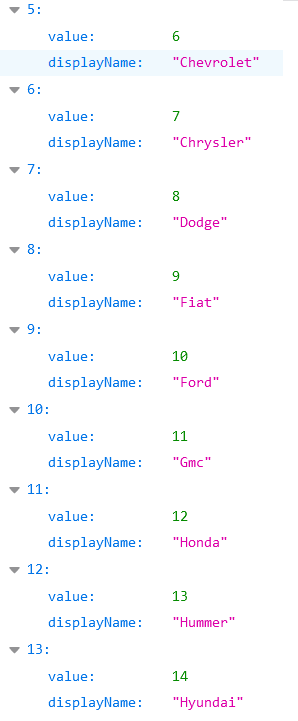

# Use Cases for Corticon.js Dynamic Forms

Implementing the complexities of a dynamic form's user interface often involves a  level of complexity comparable to that of a traditional decision automation use case (e.g. eligibility determination, claims handling, loan origination...). With Corticon.js, we can define this logic using the same declarative, rules-driven paradigm that enables traditional decision automation.

## Introduction

For scenarios where the input data for a decision is being entered into a form by an end user, the decisions-from-data paradigm can be extended to optimize dynamic data-collection logic presented to end users.

To illustrate, we'll consider a scenario where an insurance company is building out a new dynamic form to apply for a car insurance policy. They have documented business rules that they want to guide the mobile app’s behavior related to—

- Maintaining updated versions of the myriad business rules and benchmarks set forth by the policy’s eligibility rules.
- Guiding the user of the app (applicants) with prompts to gather information on the driver(s), the vehicle(s), risk factors, etc., without presenting unnecessary or unlawful prompts along the way (car insurance regulations in the United States are handled at a state level).

In this section, we’ll explore one implementation possibility for handling the form that will produce a quote.  

# Car Insurance Quote Rules

- First, the app must prompt the applicant to enter the number of drivers on the policy, number of vehicles on the policy, and their state of residents. Each of these values need to be stored, as their respective responses will elicit different form paths.
- The form will gather information for each driver, only asking questions based upon questions that are [legally allowable](https://www.thezebra.com/resources/research/car-insurance-rating-factors-by-state/) in that state.
- Next, the end user will select a vehicle make, model, and year for each of their vehicles. The ‘make’ vocabulary attribute will be selected, based upon the values available from [this](https://api.npoint.io/d487567c8a34a506350e) REST endpoint.  
- The ‘make’ attribute will now be used as part of a JSON path query, defined in the rules, to return all models from [this](https://api.npoint.io/9da0ffc399de605ffa6d) REST endpoint with the specified make.  
- Based upon the selected model, only the model years that actually exist will be presented to the end user to select in a dropdown, by similarly filtering by model at [this](https://api.npoint.io/6164bb04bfc421a11a74) REST endpoint.
- Using the accrued data about the drivers, vehicles, and allowable risk factor considerations, a policy is created with various endorsements and discounts.
  
# Building the Data Model
We can use Corticon.js Studio to model business rules to define both the dynamic form’s behavior and the eligibility/qualification rules. First, we define a unified data model—the Rule Vocabulary—that captures:

- The underwriters’ mental model of necessary data points for evaluating the applicant
- The user experience team’s vision for the logic and steps involved throughout the form’s user interface   

When working with this model in Corticon.js Studio, it is referred to as a Rule Vocabulary, but once we compile the rules into a JavaScript file, the Rule Vocabulary is translated into the JSON schema used to communicate between the front-end rendering component and the embedded business rules.

|**Rule Vocabulary - Quote Details Section**|**Rule Vocabulary - Dynamic Forms Section**|
| :-: | :-: | 
| |  |

# The Rule Vocabulary

Each of the vocabulary entities (`UI`, `UIControl`, `AutoQuote` etc) represents part of a JSON array that will be passed between the form’s presentation layer and the embedded Corticon.js decision service (a JavaScript bundle which will always be generated with the name decisionServiceBundle.js). Each attribute underlying the entities (`AutoQuote.state`, `Driver.credit_score`, etc) represents a key/value pair.

In any given use case, some of the values specified within the JSON array will only be used occasionally, and the majority of the values are relevant only ephemerally, i.e., it is unnecessary to document in the final policy quote to report that at the first stage in the application, we presented to the user each of these 50 states—we just need the actual value that was selected.

## Vocabulary Elements for Form Definition
### `UI`
The entity UI is the ‘parent’ entity, returned at index 0, which will guide things like where we are in the form, when the form is complete, and where to store the accrued data. See table below for full scope of available out of the box options. Items with an asterisk are required.

|**Attribute name**|**Acceptable Values**|**Description**|
| :-: | :-: | :-: |
|**pathToData**|Any alphanumeric string will be accepted, but in order to use user-selected responses to dynamically change form behavior in future steps, this should be set to an entity in the vocabulary that will accrue the data|
We define which data we want to store by specifying in the initial stage of the rules which vocabulary entity should ‘store’ the data accrued throughout the form. This is specified with `UI.pathToData` in an initial stage, in this case, it will be the `AutoQuote` entity. The `pathToData` entity will be at index 1 in the JSON. The stored data can then be passed along to other workflow steps once the form is complete, or used to define a conditional rule at a later stage in the form.

|
|**noUiToRenderContinue**

|T/F|
Set to 'T' for any stages where no UI needs to be rendered, but some action (a decision/calculation/augmentation of separate rulesheet) needs to be executed. Does not need to be set to 'F' when this is not the case.

|
|**done**|T/F|
Upon receiving a done instruction from the decision service (a notification of the end of the flow) via `UI.done=T`, it is expected the collected data will be passed to another function or process; typically an event will be raised with a pointer to the JSON data collected during the flow.

|
|**nextStageNumber**|Integer|
The decision service sets the attribute `UI.nextStageNumber` to specify the next step in the flow, unless it is the last stage, in which case this field is left null and `done` is set to 'true'

|
|**currentStageNumber**|Integer|
When the client side rendering component is ready for the next step in the flow, it invokes the decision service by setting `UI.currentStageNumber` to `UI.nextStageNumber` in the input payload of the decision service.

|
|**language**||On start, the rendered can accept the language from the UI but a decision service may switch the language based on some rules|

### *Container (UI.containers)*
For all steps in which something is being presented to the user (versus just a calculation/decision made in the background), the decision service will specify the list of UI controls to render from the decision service JSON payload at the `UI.containers` element. This is an array of all the containers to render for this stage. The container can be viewed as a panel containing various labels and input fields. The container has various attributes, for example a title.

|**Attribute name**|**Acceptable Values**|**Description**|
| :-: | :-: | :-: |
|**validationMsg**|Alphanumeric string|Creates a container wide validation message|
|**description**|Alphanumeric string|An optional string that doesn't impact behavior of the form. It is mostly useful for troubleshooting.|
|**id\***|Any unique alphanumeric string|Required if any container is being rendered.|
|**title\***|Alphanumeric string|h3 header on Container|

### *UIControl (UI.containers.uiControls)*
Each UI control element has multiple attributes. The most important one is the `type` attribute as it allows the client-side component to know what kind of control to render and which necessary attributes to access based on the type. See table below for full scope of available out of the box options. Items with an asterisk are required.

|**Attribute name**|**Acceptable Values**|**Description**|
| :-: | :-: | :-: |
|**type\***||
The specific type of UI Control. In the out of the box test driver, the following UI Controls / specifications are defined:

|
||type = 'Text'|Single line text field input|
||type = ‘TextArea’|Multi-lines text input|
||type = 'SingleChoice'|Renders as a checkbox with value stored as T/F|
||type = 'MultipleChoices'|Multiple choice dropdown. Options must be specified either by pointing to a JSON datasource or defining the options in a subsequent rulesheet.|
||type = 'Number'|Single number input|
||type = 'DateTime'|Date picker|
||type = 'ReadOnlyText'|A control to render HTML text|
||type = 'YesNo'|Dropdown of Yes or No, stored as Yes or No|
||type = 'YesNoBoolean'|Dropdown of Yes or No, stored as T or F|
||type = 'FileUpload'|A control to render a file upload control.|
||type = 'MultiExpenses'|List of financial line items. It contain 3 primitive UI elements: an expense type selector, an expense amount input and a currency selector.|
||type = 'MultipleChoicesMultiSelect'|Similar to MultipleChoices, but allows for multiple selected options|
|**fieldName\***|fieldName = `entity_assigned_as_pathToData.attribute` |The UI control specifies where to store the data in the field `UIControl.fieldName`. For example, if we want to store the value of a person's date of birth in a field called `dob`, within a JSON object called `Person`, we would first need to set (either in this stage or a preceding one) the `UI.pathToData = 'Person'` and then we could define the UI Control's `fieldName` to be 'dob'. This would hold the value selected for the `dob` in the JSON object as follows: `"Person" : { "dob" : "MM/DD/YYYY" }`|
|**id\***|Any unique alphanumeric string|Unique identifier (within the context of one container) for the UI control.|
|**dataSource**|URL pointing to JSON formatted data |
Specifies the datasource to populate MultipleChoices dropdown options from. Value field at the JSON endpoint must have the key `value`, display name must have the value `displayName`. If not the case for either of these, these can be overridden by specifying a child entity ‘DataSourceOptions’

|
|**max**|Integer|Optionally give the rendering component for this UI Control a numeric maximum|
|**min**|Integer|
Optionally give the rendering component for this UI Control a minimum numeric value end user can enter

|
|**minDT**|Date|Optionally give the rendering component for this UI Control a minimum date value end user can enter|
|**maxDT**|Date|
Optionally give the rendering component for this UI Control a maximum date value end user can enter

|
|**defaultValue**|Alphanumeric string|Optionally give the rendering component for this UI Control a placeholder default value|
|**multiple**|T/F|When there could be any number of responses to a prompt, set this to true. The answers are stored in an array pointed as specified by `fieldName` attribute. |
|**tooltip**|Alphanumeric string|Optionally give the rendering component for this UI Control a tooltip to assist end user|
|**label**|Alphanumeric string|Content of the prompt provided by the UI Control|
|**rows**|integer|HTML textarea rows attribute|
|**required**|T/F|Whether the user filling out the form is required to respond to this prompt|
|**validationErrorMsg**|Alphanumeric string|Creates validation message for individual UI Control|
|**cols**|integer|HTML textarea cols attribute|
|**value**|Alphanumeric string|
The content of a `ReadOnlyText` UI Control

|
|**labelPosition**|‘Above’, ‘Side’|Optionally instruct the rendering component where to place the label for this UI Control|
|**sortOptions**|'A to Z', 'Z to A'|Optionally instruct the rendering component how to sort the list of options applied to this UI Control|

When using the MultipleChoices UI Control, the actual choices can be populated from a JSON endpoint or be specified by the rule modeler. For the first option, the rule modeler must specify a URL on the field `UIControl.dataSource`. The default client renderer will look for the options at that endpoint under the `value` and `displayName` field. So if the endpoint looks like this, then you’re good to go:

If the JSON data has different keys, such as shown below, the client renderer must be told which field is going to serve as the `value` field and which as the `displayName` field—these can be, and often are, the same. These are specified with the `DataSourceOptions` entity.

### *DataSourceOptions (UI.containers.uiControls.dataSourceOptions)*

|**Attribute name**|Description|
| :-: | :-: |
|
**dataTextField**

|
Optionally define the key name to use as the display name for this option from dropdown, if its name isn't `displayName`. Oftentimes this will be the same as the `dataValueField` field.

|
|**dataValueField**|
Optionally define the name of the key whose value should be stored should end user select this option from dropdown, if its name isn't `value`. Oftentimes this will be the same as the `dataTextField` field. 

|
|**pathToOptionsArray**|
Optionally define where in a JSON endpoint is the array of options to populate a dropdown list with

|

When the rule modeler is defining the list of dropdown options, they can do so with the Option entity.

### *Option (UI.containers.uiControls.option)*

|**Attribute name**|**Description**|
| :-: | :-: |
|**displayName**|
The displayed option within a multiple-choice dropdown. When selected, it is stored as the corresponding value under the attribute assigned `UIControl.fieldName`

|
|**value**|The value stored in the `pathToData.fieldName` when user selects corresponding `displayName`. |

 # Unique Considerations when Building Rules for Dynamic Forms Rules

In a typical decision automation use case, rulesheets and ruleflows are 'connected' from one to another when constructing the top level ruleflow. Connections are the objects that connect or “stitch” assets and objects together to control their sequence of execution.

If a connector is drawn from Rulesheet `sample1.ers` to `sample2.ers`, then when a deployed Ruleflow is invoked, it will execute the rules in `sample1.ers` first, followed by the rules in `sample2.ers`.

For dynamic forms however, instead of a decision that will always go through the same chronology during a single execution, dynamic forms require the ability to navigate throughout the objects in a ruleflow, such that different rules may fire at different times, depending upon dynamic variables. For example, the sequence may be determined based upon:

-   Data that the end user has entered to that point (e.g. to route to different parts of a ruleflow depending upon what type of claim a user has chosen to file)
-    Whether any data is pre-populated at the start of a ruleflow (e.g. leveraging account information specific to the end user as part of the decision for what gets presented in the form)

<table><tr>
<td>
  

    
     
    <em style="color: grey">Dynamic Form Ruleflow </em>
  

</td>
<td>
  

    
     
    <em style="color: grey">Typical, Connected Ruleflow</em>
  

</td>
</tr></table>
